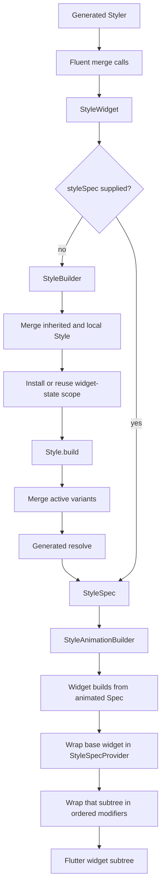

# Mix Styling and Rendering Pipeline

This guide explains how Mix turns an unresolved `Styler` into a Flutter widget
tree. It covers generation, merging, inheritance, variants, widget state,
tokens, directives, nested styles, animation, and widget modifiers.

The guide targets Mix `2.1.x` and was reverified on 2026-07-13 against the code
in this repository. The investigation started from `origin/main` at
`1edefc5ac746bf2ce7c71202f52133c38eb02aa4`; its accepted pipeline changes are
recorded in `benchmarks/rendering_pipeline/FINDINGS.md`. Here, "rendering
pipeline" means Mix's style-to-widget pipeline. Flutter still owns the later
element, render-object, layout, paint, compositing, and semantics phases.

## Contents

- [Pipeline at a Glance](#pipeline-at-a-glance)
- [Core Mental Model](#core-mental-model)
- [A Complete Example](#a-complete-example)
- [1. Spec-Driven Code Generation](#1-spec-driven-code-generation)
- [2. Widget Entry Paths](#2-widget-entry-paths)
- [3. StyleBuilder: Inheritance and State Scope](#3-stylebuilder-inheritance-and-state-scope)
- [4. Variant Resolution](#4-variant-resolution)
- [5. Widget-State Tracking](#5-widget-state-tracking)
- [6. Property Merge and Resolution](#6-property-merge-and-resolution)
- [7. Tokens and Context-Derived Values](#7-tokens-and-context-derived-values)
- [8. Directives](#8-directives)
- [9. Producing a StyleSpec](#9-producing-a-stylespec)
- [10. Animation](#10-animation)
- [11. Building the Flutter Widget](#11-building-the-flutter-widget)
- [12. Widget Modifiers](#12-widget-modifiers)
- [13. Final Widget Trees](#13-final-widget-trees)
- [14. Rebuilds and Re-resolution](#14-rebuilds-and-re-resolution)
- [15. Precedence Reference](#15-precedence-reference)
- [16. Extending the Pipeline](#16-extending-the-pipeline)
- [17. Debugging Surprises](#17-debugging-surprises)
- [Implementation Map](#implementation-map)

## Pipeline at a Glance

The normal path is:

```text
generated Styler + fluent calls
  -> non-mutating style values containing Prop values and metadata
  -> StyleWidget
  -> StyleBuilder
       merge inherited style with local style
       establish a WidgetStateProvider when needed
  -> Style.build(context)
       select and merge active variants
       call the generated resolve(context)
  -> StyleSpec<Spec>
       resolved Spec
       AnimationConfig
       resolved WidgetModifiers
  -> StyleAnimationBuilder
  -> widget.build(context, animatedSpec.spec)
  -> StyleSpecProvider
  -> RenderModifiers
  -> Flutter widget tree
```

There is also a pre-resolved path:

```text
StyleWidget(styleSpec: ...)
  -> StyleSpecBuilder
  -> animation
  -> base widget
  -> resolved modifiers
```

That path skips inheritance, active-variant selection, automatic state tracking,
and normal `Prop` resolution. It does not skip animation or modifiers already
stored in the supplied `StyleSpec`.



## Core Mental Model

Mix deliberately separates unresolved styling from resolved widget data:

```text
Styler / Style  --resolve with BuildContext-->  StyleSpec<Spec>  -->  Widget
```

| Type | Role |
| --- | --- |
| `Style<S>` | Base unresolved style contract. Holds variants, modifier config, and animation config. |
| `MixStyler<ST, S>` | Base for generated fluent stylers such as `BoxStyler`. |
| `Prop<T>` | Ordered, deferred property sources: direct values, tokens, or `Mix<T>` values, plus directives. |
| `Mix<T>` | Mergeable, context-resolvable intermediate data such as `DecorationMix` or `EdgeInsetsGeometryMix`. |
| `Spec<S>` | Immutable resolved data consumed by a widget, such as `BoxSpec`. |
| `StyleSpec<S>` | A resolved `Spec` plus animation metadata and resolved widget modifiers. |
| `ModifierMix<M>` | Unresolved, mergeable modifier data. |
| `WidgetModifier<M>` | Resolved wrapper that builds a Flutter widget around a child. |
| `StyleWidget<S>` | Stateful entry point that accepts either an unresolved `style` or a resolved `styleSpec`. |
| `IdentityStyle<S>` | A no-op style used by default widgets so inherited styles pass through without requiring an empty generated styler. |

The important boundary is that a `Styler` is not a Flutter widget style such as
`TextStyle`. It is a deferred program. Its tokens, context variants, nested Mix
objects, and directives become concrete only when resolution receives a
`BuildContext`.

## A Complete Example

```dart
const brand = ColorToken('brand.primary');

final cardStyle = BoxStyler()
    .color(brand())
    .paddingAll(16)
    .borderRounded(12)
    .onDark(.color(const Color(0xFF16181D)))
    .onHovered(.scale(1.03))
    .wrap(WidgetModifierConfig.opacity(0.96))
    .animate(.easeInOut(180.ms));

final card = MixScope(
  colors: {brand: const Color(0xFF5B5BD6)},
  child: Box(style: cardStyle, child: const Text('Account')),
);
```

At runtime:

1. Every fluent call returns a new `BoxStyler` produced by `merge`.
2. `Box` sends the style through `StyleBuilder`.
3. `StyleBuilder` sees the direct hover variant and installs interaction state
   tracking when no state scope already exists.
4. `Style.build` evaluates dark mode and hover state, then merges the active
   fragments over the base style.
5. `BoxStyler.resolve` resolves `brand()` from `MixScope`, resolves the
   `DecorationMix`, applies any directives, and resolves the opacity modifier.
6. The result is a `StyleSpec<BoxSpec>`.
7. `StyleAnimationBuilder` interpolates from the previously rendered
   `StyleSpec` when the resolved target changes.
8. `Box.build` creates a `Container` from the animated `BoxSpec`.
9. `StyleSpecProvider` exposes the active animated spec below the Mix widget.
10. `RenderModifiers` places the resolved `OpacityModifier` around that subtree.

## 1. Spec-Driven Code Generation

Mix 2.1 uses spec-driven styler generation. For `Box`, the hand-written source
defines the resolved fields and widget target:

```dart
part 'box_spec.g.dart';

@MixableSpec(target: Box.new)
@immutable
final class BoxSpec with _$BoxSpec {
  @override
  final AlignmentGeometry? alignment;

  @override
  final EdgeInsetsGeometry? padding;

  // ...

  const BoxSpec({this.alignment, this.padding});
}
```

`box_spec.g.dart` then contains both:

- `_$BoxSpec`, which implements the `Spec<BoxSpec>` contract, value equality,
  `copyWith`, diagnostics, and `lerp`.
- `BoxStyler`, including `$`-prefixed `Prop<T>?` fields, constructors, factories,
  fluent setters, `merge`, `resolve`, diagnostics, and `call`.

The current canonical files are therefore:

```text
specs/box/
  box_spec.dart       hand-written resolved fields and annotation
  box_spec.g.dart     generated _$BoxSpec and BoxStyler
  box_widget.dart     hand-written StyleWidget implementation
```

There is no current hand-written `box_style.dart`. `@MixableStyler` remains for
legacy hand-written stylers but is deprecated in favor of `@MixableSpec`.

### What a fluent call does

Generated setters create a small style fragment and merge it:

```dart
BoxStyler alignment(AlignmentGeometry value) {
  return merge(BoxStyler(alignment: value));
}
```

Generated `merge` combines three groups:

- Fields use `MixOps.merge`, which merges their `Prop` source lists.
- Variants use `MixOps.mergeVariants`, keyed by the opaque semantic identity in
  `VariantStyle.mergeKey`. `Variant.key` is only a diagnostic label.
- Modifier configs merge, while a later non-null animation config replaces the
  earlier animation config.

The existing styler is not mutated. This makes a fluent chain an ordered series
of new style values, while the `Prop` values inside those values preserve all
sources needed for later resolution. The generated fields are final, but some
styles retain caller-supplied lists such as variants; do not mutate those lists
after placing them in a style.

## 2. Widget Entry Paths

`StyleWidget<S>` is the common base for `Box`, `StyledText`, `StyledIcon`,
`StyledImage`, `FlexBox`, and `StackBox`.

It exposes two inputs:

```dart
final Style<S> style;
final StyleSpec<S>? styleSpec;
```

### Unresolved style path

When `styleSpec` is null, `StyleWidget` creates `StyleBuilder<S>` with `style`.
This is the full pipeline: inheritance, state setup, variants, `Prop`
resolution, animation, modifiers, and the widget-specific builder.

Current package widgets default to an identity style. For example:

```dart
const Box({
  super.style = const IdentityStyle(BoxSpec()),
  super.styleSpec,
  // ...
});
```

An identity style resolves to its supplied empty spec when used alone. When a
same-spec inherited style exists, `StyleBuilder` treats the identity as a no-op
and preserves the inherited style.

### Pre-resolved `StyleSpec` path

When `styleSpec` is non-null, `StyleWidget` ignores `style` and goes directly to
`StyleSpecBuilder`.

| Capability | `style` | `styleSpec` |
| --- | --- | --- |
| Merge inherited unresolved style | Yes | No |
| Select context and widget-state variants | Yes | No |
| Select named variants automatically | No | No |
| Install automatic widget-state tracking | Yes | No |
| Resolve tokens, Mix values, and Prop directives | Yes | No |
| Animate the supplied target | Yes | Yes |
| Apply resolved `widgetModifiers` | Yes | Yes |
| Build the package widget from `spec` | Yes | Yes |

Use `styleSpec` for already-resolved nested specs, caching, tests, or advanced
composition. Do not expect a token reference or unresolved variant placed into
a nominally resolved spec to run through the normal pipeline.

## 3. StyleBuilder: Inheritance and State Scope

`StyleBuilder<S>` prepares the context in which `Style.build` runs.

### Inheritance

It reads the nearest exact `StyleProvider<S>` and combines styles as:

```text
inheritedStyle.merge(localStyle)
```

Consequences:

- Inherited property sources come first; local sources come later.
- Local direct values normally win over inherited direct values.
- Mergeable `Mix` values can preserve untouched inherited subfields.
- Variants, modifiers, and animation metadata are inherited too.
- Inheritance is type-specific. A `StyleProvider<TextSpec>` is not a source for
  `BoxSpec`.
- A local `IdentityStyle<S>` preserves the inherited style, and an inherited
  identity style is ignored.

`StyleBuilder(inheritable: true)` places the final merged, still-unresolved style
in a `StyleProvider<S>` for descendants. The default is `false`; package widgets
such as `Box` do not automatically make their style inheritable.

Descendants can read that unresolved value with `Style.maybeOf<S>(context)` or
the throwing `Style.of<S>(context)`. This is distinct from
`StyleSpecProvider.of<S>(context)`, which reads the resolved, animated value much
later in the pipeline.

At the verified `origin/main`, `Style.maybeOf` uses a non-listening inherited
lookup. A `StyleProvider` update alone therefore does not invalidate an
otherwise stable consumer. PR #962 changes `of`/`maybeOf` to normal listening
semantics; until it merges, a surrounding rebuild is required for that update
to re-resolve.

### State context before resolution

After merging inheritance, `StyleBuilder` checks for direct hover and pressed
variants. It may wrap the inner resolver in either:

- `MixInteractionDetector`, for automatic hover and press tracking; or
- an internal provider backed by the caller's `WidgetStatesController`.

The actual `style.build(context)` call lives in a `Builder` below these wrappers.
That detail is essential: widget-state variants must resolve with a context that
can see the newly installed `WidgetStateProvider`.

If both inheritance and interaction wrappers are needed, the effective order is:

```text
StyleProvider                   optional, outermost
  -> interaction/controller provider
    -> Builder that calls Style.build
```

## 4. Variant Resolution

`Style.build(context)` performs two operations:

```dart
final merged = mergeActiveVariants(
  context,
  namedVariants: namedVariants,
);

return merged.resolve(context);
```

### Variant kinds

| Variant | Activation |
| --- | --- |
| `ContextVariant` | Calls `when(context)`, usually reading inherited Flutter or Mix state. |
| `NamedVariant` | Active only when present in the `namedVariants` set. |
| `WidgetStateVariant` | A `ContextVariant` that reads one state from `WidgetStateProvider`. |
| `ContextVariantBuilder` | Always selected; calls a function that returns a style from context. |

Built-in context helpers include brightness, orientation, breakpoints, text
direction, platforms, web, negation, and arbitrary media-query size predicates:

```dart
final style = BoxStyler()
    .onDark(.color(Colors.black))
    .onPortrait(.paddingAll(12))
    .onBreakpoint(customBreakpoint, .maxWidth(480))
    .onRtl(.alignment(Alignment.centerRight))
    .onWeb(.paddingAll(20));
```

| Concern | Fluent helpers / factories |
| --- | --- |
| Brightness | `onDark`, `onLight`, `ContextVariant.brightness` |
| Orientation | `onPortrait`, `onLandscape`, `ContextVariant.orientation` |
| Responsive size | `onMobile`, `onTablet`, `onDesktop`, `onBreakpoint`, `ContextVariant.size` |
| Directionality | `onLtr`, `onRtl`, `ContextVariant.directionality` |
| Platform | `onIos`, `onAndroid`, `onMacos`, `onWindows`, `onLinux`, `onFuchsia`, `ContextVariant.platform` |
| Web | `onWeb`, `ContextVariant.web` |
| Negation | `onNot`, `ContextVariant.not` |
| Dynamic style | `onBuilder`, `ContextVariantBuilder` |
| Widget state | `onHovered`, `onPressed`, `onFocused`, `onDisabled`, `onEnabled`, `ContextVariant.widgetState` |

Mix also exports common named variants: `primary`, `secondary`, `outlined`,
`solid`, `danger`, `small`, and `large`. Custom `NamedVariant` values and enums
using `EnumVariant` follow the same activation path.

### Selection and priority

The implementation has two sorting buckets, not a separate priority for every
variant kind:

1. Active non-`WidgetStateVariant` entries are merged first.
2. Active `WidgetStateVariant` entries are merged last.

At the verified `origin/main`, `mergeActiveVariants` still uses `List.sort` to
form these buckets. Dart does not guarantee that equal elements retain their
relative order, so stored order within a bucket is intended and observed by
tests but is not yet a language-level guarantee. PR #962 replaces this with a
stable linear partition; until that lands, do not rely on same-bucket order as
a hard contract. Hover, pressed, focused, and disabled do not have a semantic
priority relative to one another, so their retained order decides conflicts.

`StyleVariation` is a special value-processing branch, not a third sort bucket.
When its entry and `variantType` are active, Mix calls:

```dart
styleVariation.styleBuilder(baseStyle, namedVariants, context)
```

The returned style is merged at that entry's position and is not recursively
processed for variants. This avoids recursive `StyleVariation` loops and means
the variation is responsible for any internal variant behavior it needs.

### Nested variants

For an ordinary active variant, Mix recursively calls
`mergeActiveVariants` on the variant's style before merging it onto the base.
This supports paths such as:

```text
hovered
  -> pressed
    -> portrait
```

The child condition is considered only after its parent variant is active.

### Variant keys and merging

`Variant.key` is a human-readable label for diagnostics. It is not required to
be unique across variant kinds and is not used directly as merge identity.

`MixOps.mergeVariants` coalesces entries by the opaque semantic identity in
`VariantStyle.mergeKey`:

- named and enum variants coalesce by name;
- built-in context variants coalesce by their typed value equality;
- distinct base/custom `ContextVariant` instances remain independent even when
  their diagnostic labels match; and
- `ContextVariantBuilder` entries use function equality rather than the string
  form of `hashCode`.

This prevents a named `web` variant from collapsing into `WebVariant` and
retaining the wrong predicate. Reusing the same semantic variant still merges
its style fragments. A direct attempt to merge incompatible `VariantStyle`
identities throws an `ArgumentError` containing both runtime types and labels.

### Named variants

The standard `StyleBuilder` calls `style.build(context)` with an empty named set,
so package widgets do not activate named variants automatically.

Use one of these approaches:

```dart
final resolved = style.build(
  context,
  namedVariants: {primary, small},
);

final materialized = style.applyVariants([primary, small]);
final widget = Box(style: materialized);
```

`applyVariants` is a shallow pre-merge helper. It scans top-level named entries
and merges matching values. It does not evaluate context variants, run context
builders, recurse through nested variants, or call `StyleVariation.styleBuilder`.

The `@MixWidget` generator can also emit named constructors such as
`Button.solid(...)` for a function-backed factory with a non-nullable enum
parameter named `variant`. Those constructors select the factory argument at
widget construction time. They are distinct from the style pipeline's
`namedVariants` set and do not change the standard `StyleBuilder` behavior
described above.

### Context builders are not chain-positioned values

`.onBuilder` stores a variant. Its output is merged after the base style even if
a direct fluent call appears later in source:

```dart
final style = BoxStyler()
    .color(Colors.green)
    .onBuilder((context) => BoxStyler().color(Colors.red))
    .color(Colors.blue);
```

When the style builds, the context-builder color can override the final blue
base color. Use `ContextToken` when the requirement is a context-derived value
that must preserve exact fluent source order.

### `build`, `resolve`, and `applyVariants` are different APIs

| API | Active context variants | Named variants | Nested variants | Field resolution |
| --- | --- | --- | --- | --- |
| `style.build(context, namedVariants: ...)` | Yes | Yes | Yes | Yes |
| `style.resolve(context)` | No | No | No | Yes |
| `style.applyVariants(names)` | No | Top-level shallow merge | No | No |

Direct `resolve` is appropriate only when variants have already been
materialized or are intentionally unsupported in that path.

Current direct-style resolution paths include:

- phase animation styles;
- keyframe `styleBuilder` results;
- the nested style held by `BoxModifierMix`;
- `TextScope` and `IconScope`; and
- explicit calls from application or test code.

`BoxModifierMix`, `TextScope`, and `IconScope` take only the resolved core spec,
so animation and modifier metadata on their input style are not rendered by
those helpers either.

### Nested styles inside Props

Composite stylers hold sub-styles as `Prop<StyleSpec<ChildSpec>>`. When
`Prop.resolveProp` discovers that the merged `Mix` is a `Style`, it calls the
nested style's `build(context)`, not `resolve(context)`. This preserves nested
brightness, breakpoint, and widget-state variants.

Named variants are not propagated into that nested call; it uses the default
empty named set.

## 5. Widget-State Tracking

Widget-state variants read `WidgetStateProvider` during variant selection.

### Automatic tracking

After inheritance is merged, `StyleBuilder` inspects only direct, top-level
`WidgetStateVariant` entries in `$variants`. If a hover or pressed variant
exists, no external controller was supplied, and no provider is already in
scope, it inserts a `MixInteractionDetector`. Other states cannot be produced
by that detector and therefore do not install pointer tracking by themselves.

The detector's internal tree is:

```text
IgnorePointer
  -> MouseRegion
    -> Listener
      -> PointerPositionProvider
        -> ListenableBuilder
          -> WidgetStateProvider
            -> styled subtree
```

It drives hover and primary press state. It also provides normalized cursor
position and the raw local offset through `PointerPosition.of(context)` while
the pointer is inside the detector.

### States that need an owner

The fluent state helpers are:

| Helper | Variant |
| --- | --- |
| `onHovered` | direct `WidgetState.hovered` |
| `onPressed` | direct `WidgetState.pressed` |
| `onFocused` | direct `WidgetState.focused` |
| `onDisabled` | direct `WidgetState.disabled` |
| `onEnabled` | negation of the disabled context variant |

Automatic detection handles pointer hover and press, but it does not create
focus events or make a normal styled widget disabled. Use `Pressable`,
`PressableBox`, or `StyleBuilder(controller: ...)` for focus, disabled, selected,
dragged, error, `scrolledUnder`, or other programmatic state.

The current controller API accepts `WidgetState.scrolledUnder`, but the
verified `origin/main` provider still resolves that state as false. PR #962
stores, reads, and sends aspect-specific notifications for it. Treat
`scrolledUnder` variants as pending until that PR merges.

`Pressable` adds gesture callbacks, focus, actions and keyboard activation,
cursor selection, semantics, feedback, and disabled interaction gating around a
shared `MixInteractionDetector`.

### Discovery limitations

Automatic detector creation cannot see widget-state variants that exist only:

- inside another variant;
- inside a nested sub-style; or
- in a style returned later by `ContextVariantBuilder`.

Those variants resolve correctly when a `WidgetStateProvider` already exists,
but they cannot cause `StyleBuilder` to install one. Pass a controller or wrap
the widget in `Pressable` when state exists below the top-level style.

`onEnabled` is a negated `ContextVariant`, not a direct
`WidgetStateVariant`. It does not trigger automatic tracking. With no state
provider, disabled reads as false, so `onEnabled` is active.

## 6. Property Merge and Resolution

Every generated unresolved field is a `Prop<T>?`. A `Prop` stores an ordered
list of sources:

| Source | Created by | Resolution result |
| --- | --- | --- |
| `ValueSource<T>` | `Prop.value` / `Prop.maybe` | The direct value. |
| `TokenSource<T>` | `Prop.token` or a recognized token reference | A value from the token's resolver. |
| `MixSource<T>` | `Prop.mix` / `Prop.maybeMix` | An unresolved mergeable `Mix<T>`. |

`mergeProp` appends both source lists and appends both directive lists. It does
not decide the winner during merge.

### Resolution algorithm

`Prop.resolveProp(context)` performs these steps:

1. Resolve every token source; keep direct values and Mix sources in order.
2. Check whether any resulting value is a `Mix<T>`.
3. If no Mix value exists, return the last value.
4. If a Mix value exists, try to convert each direct value through
   `MixConverterRegistry`, then merge all convertible Mix values in order.
5. Resolve the merged Mix. If it is a nested `Style`, call `build(context)`;
   otherwise call `resolve(context)`.
6. Apply directives to the final value in order.

This produces two common semantics:

```dart
// Direct values: replacement.
BoxStyler().alignment(Alignment.topLeft).alignment(Alignment.center);

// Mix values: field-wise accumulation.
BoxStyler().paddingAll(8).paddingLeft(16);
// Resolves to left 16, with the other sides still 8.
```

When a property mixes direct values with Mix values, every direct value needs a
registered converter. An unconvertible direct value is omitted from the Mix
merge; debug builds print a diagnostic. Property APIs should therefore use
compatible direct/Mix representations or register the appropriate converter.

`DecorationMix` and `ShapeBorderMix` use specialized, context-aware mergers for
cross-type combinations. Other Mix objects use their normal `merge` contract.

A directives-only `Prop` has no source and cannot resolve by itself. It must be
merged with a value or token source first; otherwise resolution throws a
`FlutterError`.

## 7. Tokens and Context-Derived Values

Calling a supported `MixToken<T>` produces a type-shaped reference that the
`Prop` factory recognizes as a `TokenSource`:

```dart
const brand = ColorToken('brand.primary');
const gap = SpaceToken('space.md');

final style = BoxStyler()
    .color(brand())
    .paddingAll(gap());
```

At resolution, a normal token calls `MixScope.tokenOf(token, context)`. A scope
entry may be either a value or a function of the consuming context:

```dart
MixScope(
  tokens: {
    brand: (BuildContext context) => Theme.of(context).colorScheme.primary,
  },
  child: Box(style: style),
);
```

### ContextToken

`ContextToken<T>` supplies its own context resolver and needs no `MixScope` by
default:

```dart
final primary = ContextToken<Color>(
  (context) => Theme.of(context).colorScheme.primary,
);

final style = BoxStyler()
    .color(primary())
    .color(Colors.red); // red wins because it is the later Prop source
```

If a matching `ContextToken` is present in `MixScope`, the scope value or scope
resolver overrides its built-in resolver. Context-token equality is based on
the value type and resolver identity, so reusable top-level or static resolver
functions make reliable override keys.

Context tokens are different from `.onBuilder`: they are ordinary property
sources and preserve fluent order exactly.

### Scope behavior and errors

A plain nested `MixScope` shadows an ancestor scope. Use `MixScope.inherit` when
a subtree should override some tokens while preserving the rest, or
`MixScope.combine` to merge independent scopes deliberately.

Resolution failures for ordinary scope-backed tokens are clear:

- no `MixScope` for a normal token: `FlutterError`;
- token absent from an existing scope: `StateError`;
- token value has the wrong type: `StateError`.

The canonical `BreakpointToken.mobile`, `BreakpointToken.tablet`, and
`BreakpointToken.desktop` values are an intentional exception. They use built-in
breakpoint defaults when a scope or token entry is absent. A present entry with
the wrong type still throws, and custom `BreakpointToken` values use the normal
scope-backed error behavior.

Token-call syntax supports the reference types registered in
`token_refs.dart`. A custom token with an unsupported value type cannot use the
base `call()` implementation; resolve it explicitly, use `Prop.token` in an
advanced API, or implement a custom reference. Never pass an unresolved token
reference to an ordinary Flutter API and expect Flutter to resolve it.

The built-in reference set covers `Color`, `double` (including space tokens),
`Radius`, `Shadow`, `BoxShadow`, `TextStyle`, `Breakpoint`, `BorderSide`,
`FontWeight`, `Duration`, `List<Shadow>`, and `List<BoxShadow>`.

## 8. Directives

Directives transform data without changing merge semantics or adding a widget
wrapper.

### Prop directives

`Prop.$directives` are accumulated during merge and run after the final value is
selected or the final Mix value is resolved.

Examples include:

- color-reference transforms such as `withValues`, `withAlpha`, and
  `withOpacity`;
- number transforms such as `multiply`, `add`, `subtract`, `divide`, `clamp`,
  `abs`, `round`, `floor`, and `ceil`; and
- custom `Directive<T>` implementations.

```dart
final translucent = BoxStyler().color(brand().withOpacity(0.7));
final doubled = Prop.value(8.0).multiply(2);
```

If two Props merge, their directive lists concatenate. The earlier directives
run before the later directives.

### Text directives

Text transforms use a separate path. `TextStyler.uppercase`, `lowercase`,
`capitalize`, `titlecase`, and `sentencecase` store `Directive<String>` objects
in `TextSpec.textDirectives`. That field follows generated list-merge semantics;
it is not the same append-only directive chain used by `Prop.$directives`.

They are not applied by `Prop.resolveProp`. `StyledText.build` applies the
resolved directive list to the widget's input string immediately before it
constructs Flutter's `Text` widget.

## 9. Producing a StyleSpec

After active variants have merged, the generated styler resolver constructs the
resolved spec. In simplified form, `BoxStyler.resolve` is:

```dart
StyleSpec<BoxSpec> resolve(BuildContext context) {
  final spec = BoxSpec(
    alignment: MixOps.resolve(context, $alignment),
    padding: MixOps.resolve(context, $padding),
    decoration: MixOps.resolve(context, $decoration),
    // ...
  );

  return StyleSpec(
    spec: spec,
    animation: $animation,
    widgetModifiers: $modifier?.resolve(context),
  );
}
```

At this boundary:

- spec fields are concrete Flutter or nested `StyleSpec` values;
- normal tokens and context tokens have resolved;
- Mix objects have merged and resolved;
- Prop directives have run;
- modifier Mix objects have become ordered `WidgetModifier` objects; and
- animation configuration is attached unchanged for the animation stage.

`StyleSpec<S>` itself is a `Spec<StyleSpec<S>>`. It has value equality,
`copyWith`, diagnostics, and `lerp`, allowing the entire resolved result to be
an animation target.

## 10. Animation

`StyleSpecBuilder` always creates `StyleAnimationBuilder`, including when there
is no animation config.

### Driver selection

| `StyleSpec.animation` | Driver | Behavior |
| --- | --- | --- |
| `CurveAnimationConfig` | `CurveAnimationDriver` | Fixed duration, optional delay, curve, and `onEnd`. |
| `SpringAnimationConfig` | `SpringAnimationDriver` | Unbounded controller driven by `SpringSimulation`, with optional `onEnd`. |
| `PhaseAnimationConfig` | `PhaseAnimationDriver` | Cyclic sequence of styles and per-transition curve configs. |
| `KeyframeAnimationConfig` | `KeyframeAnimationDriver` | Parallel named tracks mapped back into a style. |
| null | No driver | Calls the style builder directly with the target spec. |

On first build, a null config skips driver and `AnimatedBuilder` creation. When
a `CurveAnimationConfig` or `SpringAnimationConfig` is removed during an
update, `StyleAnimationBuilder` reuses that implicit driver's old config long
enough to animate toward the new unconfigured target. This is not a general
outgoing transition rule: phase and keyframe drivers do not retarget through
`didUpdateSpec`, so removing either config does not animate that driver toward
the supplied target in the same update.

Mix does not read `MediaQuery.disableAnimations` or provide a global
reduced-motion policy. Its bounded Flutter controllers still use Flutter's
default accessibility behavior, which shortens one-shot transitions when
platform accessibility disables animations. That does not remove motion
entirely, and unbounded spring animation or repeating phase/keyframe loops need
an explicit application policy when reduced motion is required.

### Implicit curve and spring animation

When a new `StyleSpec` arrives, an implicit driver uses the currently animated
value as the next tween's beginning and the new resolved value as its target.
Interrupted transitions therefore continue from the visible intermediate state
instead of restarting from the previous target.

`AnimationConfig` exposes Flutter curve families, custom curve configs, fixed
duration spring curves, and physics spring descriptions. Curve configs support
delay; physics spring configs do not have a delay field.

### Phase animation

`.phaseAnimation` turns each phase into a style and a
`CurveAnimationConfig`. The driver resolves those styles, creates a
`TweenSequence`, and includes the last-to-first transition.

- With a `Listenable trigger`, every notification starts one run.
- With no trigger, the controller repeats automatically.
- The total duration is the sum of all phase config durations and delays.

### Keyframe animation

`.keyframeAnimation` creates named `KeyframeTrack<T>` objects. Segments in one
track run sequentially; tracks run in parallel. The overall duration is the
maximum track duration. Shorter tracks occupy an initial interval of that total
timeline.

On each animation tick, the driver:

1. transforms every track into its current value;
2. exposes the values through `KeyframeAnimationResult.get<T>(id)`;
3. calls `styleBuilder(values, initialStyle)`; and
4. directly resolves the returned style.

Like phase animation, a trigger starts one run and an omitted trigger loops.

### What interpolates

`StyleSpec.lerp` interpolates:

- the core `Spec` through its generated `lerp`;
- the resolved modifier list through `ModifierListTween`; and
- animation metadata by preferring the target's non-null config.

Generated spec code uses `MixOps.lerp` for supported types and `MixOps.lerpSnap`
for enum and other discrete fields. Colors, geometry, constraints, decorations,
text styles, shadows, and matrices have specialized interpolation. Most
unsupported values snap at `t = 0.5`. A null matrix endpoint is treated as the
identity matrix.

### Animation boundaries and caveats

Phase styles and keyframe builder results call `resolve(context)`, not
`build(context)`. Variants carried inside those animation-owned styles are not
selected there unless they were materialized before the animation config was
created.

Modifier interpolation is target-list based:

- modifiers present only in the beginning are not retained in the result;
- a target modifier lerps from a matching beginning modifier when available;
- otherwise it lerps from `defaultModifier[type]` when registered; and
- types with neither a beginning nor a registered default do not have a safe
  smooth introduction path.

When adding an animatable modifier, provide a neutral default when possible and
test both addition and removal transitions.

## 11. Building the Flutter Widget

The animation builder passes the current animated core spec to the concrete
`StyleWidget` implementation.

For `Box`, that implementation is a direct mapping to `Container`:

```dart
Widget build(BuildContext context, BoxSpec spec) {
  return Container(
    alignment: spec.alignment,
    padding: spec.padding,
    decoration: spec.decoration,
    foregroundDecoration: spec.foregroundDecoration,
    constraints: spec.constraints,
    margin: spec.margin,
    transform: spec.transform,
    transformAlignment: spec.transformAlignment,
    clipBehavior: spec.clipBehavior ?? Clip.none,
    child: child,
  );
}
```

The widget should consume only resolved spec values. Context-dependent style
logic belongs before this boundary unless it is ordinary Flutter widget logic.

### Composite specs

`FlexBoxSpec` and `StackBoxSpec` contain nested `StyleSpec` values. For example:

```dart
final class FlexBoxSpec with _$FlexBoxSpec {
  final StyleSpec<BoxSpec>? box;
  final StyleSpec<FlexSpec>? flex;
}
```

The parent styler stores unresolved child stylers in Props. As described above,
those child styles use `build(context)` during property resolution. `FlexBox`
then builds its `Flex` and sends the resolved box portion through
`Box(styleSpec: spec.box, child: flexWidget)`.

That nested `Box` skips a second style-resolution pass but still runs its own
`StyleSpecBuilder`, so animation and modifiers embedded in the nested
`StyleSpec<BoxSpec>` remain meaningful.

The layout portions do not have that second stage. `FlexBox` consumes only
`spec.flex?.spec`, and `StackBox` consumes only `spec.stack?.spec`; animation
and `widgetModifiers` stored on those inner layout `StyleSpec` values are not
rendered independently. Attach layout-level animation or wrappers to the parent
`FlexBoxStyler` or `StackBoxStyler`, or use a widget that owns a
`StyleSpecBuilder` for that layout spec.

## 12. Widget Modifiers

Modifiers represent behavior that belongs in Flutter wrappers rather than core
spec fields: opacity, visibility, clipping, layout wrappers, inherited themes,
and similar operations.

```dart
final style = BoxStyler().wrap(
  WidgetModifierConfig.opacity(0.8)
      .padding(EdgeInsetsGeometryMix.all(12)),
);
```

### Unresolved to resolved

The two modifier layers mirror Styler and Spec:

```text
ModifierMix<WidgetModifier>
  --merge and resolve with context-->
WidgetModifier
  --build(child)-->
Flutter wrapper
```

When two `WidgetModifierConfig` objects merge, their modifier lists are
coalesced by `mergeKey`, and later entries of the same key merge with the earlier
one. `ResetModifierMix` clears all modifiers accumulated before it during that
config merge. A resolved reset is filtered before rendering.

`WidgetModifierConfig.resolve` then:

1. resolves each `ModifierMix`;
2. removes `ResetModifier`;
3. orders resolved modifiers by type; and
4. returns an outermost-to-innermost list.

### Built-in configuration surface

| Category | Factories |
| --- | --- |
| Visibility/effects | `opacity`, `blur`, `visibility`, `shaderMask` |
| Clipping | `clipOval`, `clipRect`, `clipRRect`, `clipPath`, `clipTriangle` |
| Transform | `transform`, `scale`, `rotate`, `translate`, `skew`, `rotatedBox` |
| Layout/size | `flexible`, `sizedBox`, `fractionallySizedBox`, `intrinsicHeight`, `intrinsicWidth`, `aspectRatio`, `align`, `padding` |
| Inherited style | `defaultTextStyle`, `defaultText`, `defaultTextStyler`, `defaultIcon`, `iconTheme` |
| Composition | `box`, `modifier`, `modifiers`, `reset`, `orderOfModifiers` |

Other exported `ModifierMix` types can be supplied through `modifier` even when
there is no dedicated convenience factory.

`defaultTextStyle` and `iconTheme` flatten resolved values into Flutter's
inherited theme widgets. `defaultTextStyler` is different: its resolved
modifier deliberately retains the full unresolved `TextStyler` and creates a
`StyleProvider<TextSpec>`, so descendant `StyledText` widgets still receive
Mix merge semantics, variants, modifiers, and animation metadata.

The standalone `TextScope` and `IconScope` helpers use the flatter direct
`resolve` path described earlier. They are useful for Flutter
`DefaultTextStyle`/`IconTheme` integration, but they do not replace
`defaultTextStyler` when descendants need the full Mix pipeline.

### Default wrapper order

The package default, from outermost to innermost, is:

1. Context and behavior: `Flexible`, `Visibility`, `IconTheme`,
   `DefaultTextStyle`, `DefaultTextStyler`.
2. Size: `SizedBox`, `FractionallySizedBox`, intrinsic height/width,
   `AspectRatio`.
3. Layout: `RotatedBox`, `Align`.
4. Spacing: `Padding`.
5. Visual effects: transform variants, clip variants, `Blur`, `Opacity`,
   `ShaderMask`.
6. Any remaining custom modifier types, in their resolved-list order.

A style-local custom prefix can be set with:

```dart
WidgetModifierConfig.orderOfModifiers([
  OpacityModifier,
  PaddingModifier,
]);
```

The custom types are considered first, followed by default types and remaining
types, with duplicates removed.

`MixScope(orderOfModifiers: ...)` stores and exposes an inherited order, but the
standard `WidgetModifierConfig.resolve(context)` path does not read it. In the
current rendering pipeline, modifier order must be attached to the style's
`WidgetModifierConfig` to affect rendering.

### Wrapper construction

`RenderModifiers` reverses the ordered list and calls `build(child)` from the
inside out. Therefore the first modifier in the ordered list becomes the
outermost Flutter wrapper.

`StyleSpecProvider` is created before the modifier wrappers are applied, so the
provider sits inside all rendered modifiers and immediately above the base Mix
widget.

## 13. Final Widget Trees

The most complete normal tree is:

```text
StyleBuilder<S>
  -> StyleProvider<S>                         optional, when inheritable
    -> MixInteractionDetector                 optional, automatic state
       or external-controller provider        optional, supplied controller
      -> Builder                              calls style.build(context)
        -> StyleSpecBuilder<S>
          -> StyleAnimationBuilder<S>
            -> modifier[0]                    outermost resolved modifier
              -> modifier[1]
                -> ...
                  -> StyleSpecProvider<S>
                    -> concrete Flutter widget
```

Without modifiers, `StyleSpecProvider` directly wraps the concrete widget.

The pre-resolved path is shorter:

```text
StyleWidget(styleSpec: resolved)
  -> StyleSpecBuilder<S>
    -> StyleAnimationBuilder<S>
      -> resolved modifier wrappers
        -> StyleSpecProvider<S>
          -> concrete Flutter widget
```

The pre-resolved path has no `StyleBuilder`, so it has no style inheritance,
automatic detector, or active-variant pass.

## 14. Rebuilds and Re-resolution

Mix relies on Flutter dependencies established while `style.build(context)` and
its nested resolvers run.

The resolved target can change when:

- the parent rebuilds with a different `Style`;
- a context variant reads changed `MediaQuery`, directionality, platform
  brightness, or other inherited data;
- a token or resolver depends on a changed `MixScope`, `Theme`, or other
  inherited widget;
- `WidgetStateProvider` changes a state used by an active variant; or
- an inherited same-spec style changes as its surrounding subtree rebuilds.

That last qualifier is important on the verified `origin/main`:
`Style.maybeOf` does not yet register an inherited dependency. A provider-only
update behind an identical child can remain stale until another rebuild occurs.
PR #962 repairs the dependency.

Each new resolved target goes to `StyleAnimationBuilder`. It does not mutate the
old target; it either exposes the new value immediately or animates between
them.

Phase and keyframe triggers are different: their `Listenable` drives the
animation controller directly. A trigger notification does not run the outer
`StyleBuilder` variant pass.

`StyleSpecProvider.of<S>(context)` creates a dependency on the current animated
`StyleSpec<S>`, so descendants using it rebuild as that provided spec changes.

## 15. Precedence Reference

For the normal path, later layers generally override earlier ones:

| Order | Layer | Rule |
| --- | --- | --- |
| 1 | Inherited unresolved style | Starting point for the same `Spec` type. |
| 2 | Local unresolved style | Merged on top of inheritance. |
| 3 | Active non-widget-state variants | Merged in stored order over the base. |
| 4 | Active widget-state variants | Merged last, in stored order. |
| 5 | Prop source resolution | Last direct/token value wins, or Mix values accumulate field-wise. |
| 6 | Prop directives | Run in accumulated order after the value resolves. |
| 7 | Animation | Interpolates the old resolved `StyleSpec` toward the new one. |
| 8 | Modifiers | Wrap according to type order; this is tree order, not property precedence. |

Important exceptions:

- `StyleVariation` runs at its active entry's position and skips recursive
  variant processing for its result.
- `ContextVariantBuilder` is a variant, so it is merged after the base rather
  than at its visual fluent-chain position.
- A later animation config replaces an earlier non-null animation config.
- Modifier values merge by `mergeKey`; they are not simple appended wrappers.
- `styleSpec` bypasses layers 1 through 6 because it is already resolved.

## 16. Extending the Pipeline

### Add a widget-backed Spec and Styler

1. Define an immutable resolved spec with nullable resolved fields.
2. Add `@MixableSpec(target: YourWidget.new)` and `part '...g.dart'`.
3. Mix in the generated `_$YourSpec` contract.
4. Let the generator create `YourStyler`; use field annotations and curated type
   metadata for special setter, factory, mixin, or lerp behavior.
5. Extend `StyleWidget<YourSpec>` in the target widget.
6. Default its style to `IdentityStyle(YourSpec())` when an empty const spec is
   valid.
7. Build the Flutter widget only from the resolved spec.
8. Run `melos run gen:build`.
9. Test direct fields, fluent merge order, context and state variants,
   inheritance, direct `styleSpec`, and interpolation.

Use `@MixableSpec()` without a target for specs that still need a generated
styler but do not own a widget `call()` surface, such as nested layout specs.

### Add a Mix property type

1. Implement a mergeable and resolvable `Mix<T>` representation.
2. Use `Prop<U>?` fields for its unresolved parts.
3. Register resolved-to-Mix conversion when direct `T` values must combine with
   Mix values.
4. Add curated generator metadata for inferred setter types, owner mixins,
   diagnostics, and lerp behavior when needed.
5. Test direct-only, Mix-only, mixed-source, token, directive, and merge-order
   cases.

### Add a modifier

1. Create a `WidgetModifier` with immutable resolved fields and `build(child)`.
2. Prefer `@MixableModifier()` to generate its contract and matching
   `ModifierMix`; implement a custom lerp when the generated policy is wrong.
3. Add a `WidgetModifierConfig` convenience API when it belongs in the public
   surface.
4. Add the resolved type to the package default order when wrapper position is
   meaningful.
5. Add a neutral entry to `defaultModifier` when adding the modifier should
   animate from absence.
6. Test merge-by-key, reset, custom order, actual widget nesting, and animation
   in both directions.

## 17. Debugging Surprises

| Symptom | Likely cause |
| --- | --- |
| A context or hover variant is ignored | The code called `resolve` instead of `build`, or no required state provider exists. |
| A named variant is ignored by `Box(style: ...)` | Standard `StyleBuilder` has no active named set; materialize it or call `build` explicitly. |
| A nested hover variant never changes | Automatic state discovery sees only direct top-level variants; provide a controller or `Pressable`. |
| `onEnabled` applies without a controller | Missing state means disabled is false, and `onEnabled` is a negated context variant. |
| An inherited style stays stale after only `StyleProvider` changes | `Style.maybeOf` is currently a non-listening lookup; rebuild the surrounding subtree or use the fix in #962 once merged. |
| A `scrolledUnder` variant never activates | `WidgetStateProvider` currently resolves that state as false; support is pending in #962. |
| A later fluent value loses to `.onBuilder` | Context-builder output is an active variant merged after the base. |
| A token throws outside Mix | Token references are deferred placeholders, not concrete Flutter values. |
| A token disappears after adding a nested `MixScope` | A plain nested scope shadows its parent; use `MixScope.inherit`. |
| `onMobile`, `onTablet`, or `onDesktop` works without a `MixScope` | Canonical breakpoint tokens have built-in defaults; custom breakpoint tokens still need a scope entry. |
| A mixed direct/Mix property loses the direct value | No converter was registered for that resolved type. |
| `style` has no effect when `styleSpec` is supplied | `StyleWidget` gives `styleSpec` precedence and skips `StyleBuilder`. |
| Modifier nesting looks reversed | The resolved list is outermost-first; rendering reverses it while constructing wrappers. |
| `MixScope.orderOfModifiers` has no effect | The standard modifier resolver uses only `WidgetModifierConfig.$orderOfModifiers`. |
| A modifier appears or disappears abruptly | The field snaps, the target list removed it, or its type has no neutral default for list interpolation. |
| Phase/keyframe styles ignore variants | Those animation drivers directly call `resolve` on their owned styles. |
| Removing a phase/keyframe config does not animate out | Only implicit curve/spring drivers retarget a new spec during that transition. |
| `TextScope` or `IconScope` ignores variants/modifiers | Those helpers directly resolve and consume only the core spec. |
| An inner Flex/Stack modifier or animation does nothing | Composite layout widgets consume the nested layout core spec and do not run its `StyleSpecBuilder`. |

## Implementation Map

Start with these files when tracing a behavior:

| Concern | Source |
| --- | --- |
| Widget entry and direct-spec branch | `packages/mix/lib/src/core/style_widget.dart` |
| Inheritance, state setup, and final assembly | `packages/mix/lib/src/core/style_builder.dart` |
| Variant selection and `build` vs `resolve` | `packages/mix/lib/src/core/style.dart` |
| Variant types and `StyleVariation` | `packages/mix/lib/src/variants/variant.dart` |
| Fluent variant APIs | `packages/mix/lib/src/style/mixins/variant_style_mixin.dart` and `packages/mix/lib/src/style/mixins/widget_state_variant_mixin.dart` |
| Property sources and nested-style behavior | `packages/mix/lib/src/core/prop.dart` and `packages/mix/lib/src/core/prop_source.dart` |
| Merge, resolve, and lerp helpers | `packages/mix/lib/src/core/helpers.dart` |
| Tokens and scopes | `packages/mix/lib/src/theme/tokens/` and `packages/mix/lib/src/theme/mix_theme.dart` |
| Resolved wrapper | `packages/mix/lib/src/core/style_spec.dart` |
| Animation lifecycle | `packages/mix/lib/src/animation/style_animation_builder.dart` and `packages/mix/lib/src/animation/style_animation_driver.dart` |
| Modifier merge, order, and interpolation | `packages/mix/lib/src/modifiers/widget_modifier_config.dart` |
| Modifier widget wrapping | `packages/mix/lib/src/modifiers/internal/render_modifier.dart` |
| Interaction state | `packages/mix/lib/src/core/internal/mix_interaction_detector.dart` and `packages/mix/lib/src/core/providers/widget_state_provider.dart` |
| Current generated reference | `packages/mix/lib/src/specs/box/box_spec.g.dart` |
| Current widget reference | `packages/mix/lib/src/specs/box/box_widget.dart` |
| Composite reference | `packages/mix/lib/src/specs/flexbox/` |
| Generator implementation | `packages/mix_generator/lib/src/spec_styler_generator.dart` and `packages/mix_generator/lib/src/core/builders/spec_styler_class_builder.dart` |

Representative contract tests include:

- `packages/mix/test/src/core/style_widget_default_style_test.dart`
- `packages/mix/test/src/core/style_builder_test.dart`
- `packages/mix/test/src/core/style_get_all_variants_test.dart`
- `packages/mix/test/src/core/style_nested_variants_test.dart`
- `packages/mix/test/src/core/nested_style_variant_test.dart`
- `packages/mix/test/src/core/prop_test.dart`
- `packages/mix/test/src/theme/tokens/context_token_integration_test.dart`
- `packages/mix/test/src/animation/style_animation_builder_test.dart`
- `packages/mix/test/src/animation/style_animation_driver_test.dart`
- `packages/mix/test/src/modifiers/reset_behavior_test.dart`
