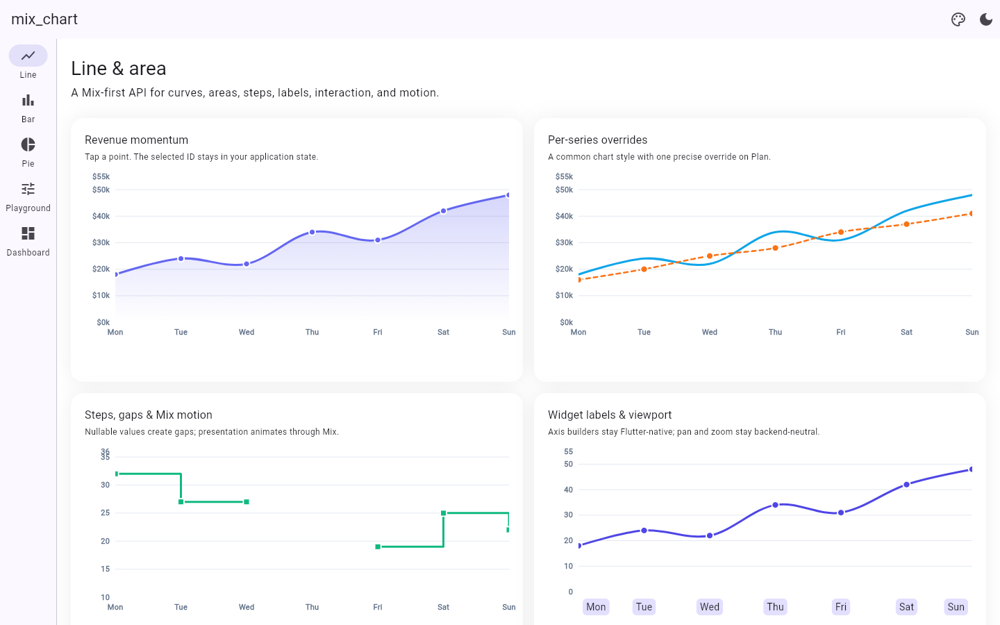
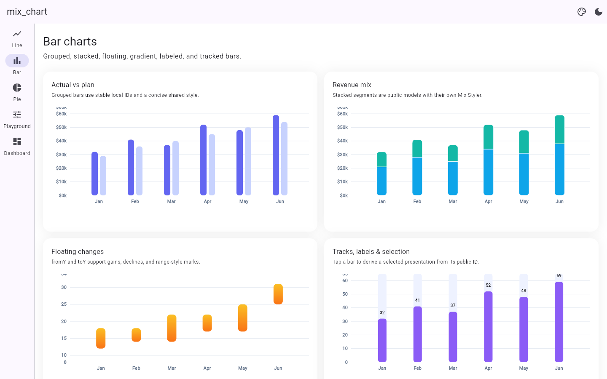
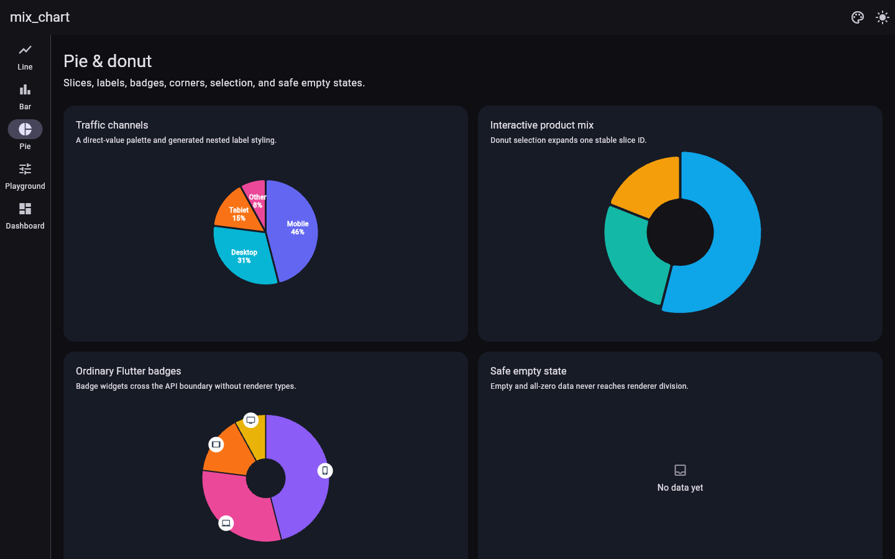
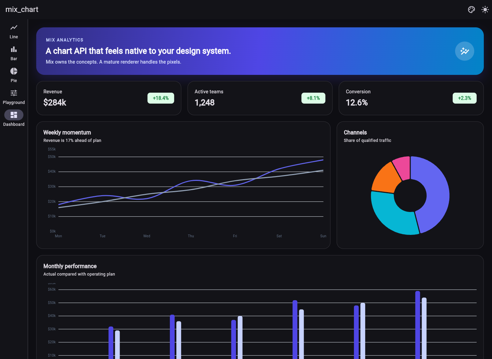
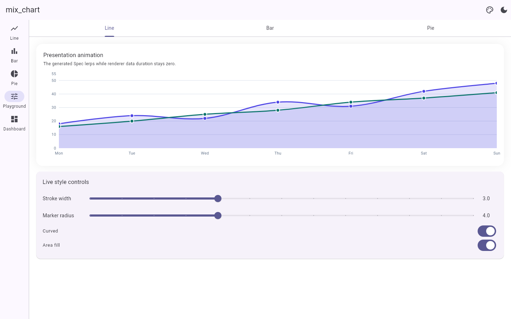
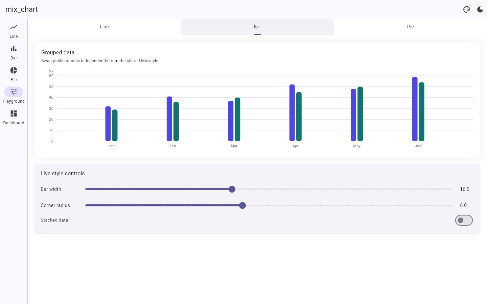
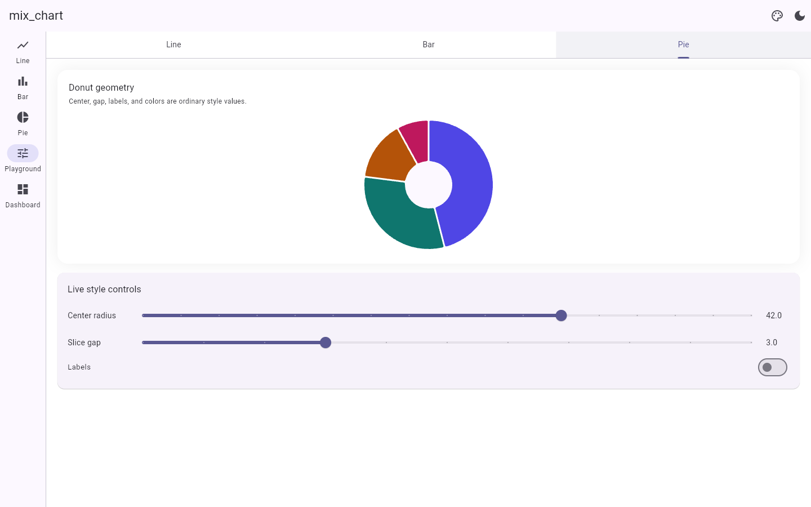

# mix_chart

Type-safe Flutter charts styled with [Mix](https://pub.dev/packages/mix).

`mix_chart` owns the chart API—data models, axes, interactions, semantics,
Specs, and generated Stylers—while a mature renderer remains a private
implementation detail. Applications only import `mix_chart` and `mix`.

## Why a Mix chart API?

- One fluent styling model for charts and the rest of your UI.
- Contextual dot shorthand, named factories, and instance methods.
- Direct `Color`, `Gradient`, `BorderSide`, `TextStyler`, and dimension values.
- Optional consumer-owned Mix tokens and variants; no package token registry.
- Stable IDs in callbacks and scoped selection keys instead of renderer indices.
- Arbitrary Flutter widgets for axis labels, badges, and custom tooltips.
- Predictable animation ownership, reduced motion, and safe topology changes.

The first release includes line/area, grouped/stacked/floating bar, and
pie/donut charts.

## Gallery

| Line charts | Bar charts |
| --- | --- |
|  |  |

| Pie and donut charts | Analytics dashboard |
| --- | --- |
|  |  |

### Interactive playground



| Bar controls | Pie and donut controls |
| --- | --- |
|  |  |

## Quick start

```dart
import 'package:flutter/material.dart';
import 'package:mix/mix.dart';
import 'package:mix_chart/mix_chart.dart';

LineChart(
  semanticsLabel: 'Weekly revenue',
  series: [
    LineSeries(
      id: 'revenue',
      label: 'Revenue',
      points: [
        ChartPoint(id: 'mon', x: 0, y: 18),
        ChartPoint(id: 'tue', x: 1, y: 31),
        ChartPoint(id: 'wed', x: 2, y: 27),
      ],
      style: .stroke(
        .color(const Color(0xFF6366F1)).width(3),
      ).marker(.show(true).radius(4)),
    ),
  ],
  xAxis: ChartAxis.numeric(
    interval: 1,
    labelFormatter: (value) => ['Mon', 'Tue', 'Wed'][value.round()],
  ),
  yAxis: ChartAxis.numeric(
    min: 0,
    labelFormatter: (value) => '\$${value.toInt()}k',
  ),
  style: .axis(
    .label(
      .fontSize(11).color(const Color(0xFF64748B)),
    ),
  ).grid(
    .showVertical(false).stroke(
      .color(const Color(0xFFE2E8F0)).width(1),
    ),
  ).series(
    .curve(LineCurve.curved).belowArea(
      .show(true).color(const Color(0x226366F1)),
    ),
  ).frame(.showBorder(false).clip(true)),
  onPointTap: (hit) => selectPoint(hit.selectionKey),
)
```

Point IDs are unique within a series, while bar and segment IDs are unique
within their parents. Selection therefore uses hierarchical keys:

```dart
LinePointKey? selectedPoint;
BarSelectionKey? selectedBarItem;

LineChart(
  series: series,
  selectedPoints: {?selectedPoint},
  onPointTap: (hit) => selectedPoint = hit.selectionKey,
);

BarChart(
  groups: groups,
  selectedItems: {?selectedBarItem},
  onBarTap: (hit) => selectedBarItem = hit.selectionKey,
);
```

Use `BarSelectionKey.bar(...)` or `BarSelectionKey.segment(...)` when
constructing selection state without an interaction hit.

The generated API supports all three composition forms:

```dart
final factory = LineChartStyler.axis(
  ChartAxisStyler.label(TextStyler.fontSize(11)),
);

final fluent = LineChartStyler()
    .axis(.label(.fontSize(11)))
    .grid(.stroke(.width(1)));

LineChart(
  series: series,
  style: .axis(.label(.fontSize(11))),
);
```

## Bar and pie

```dart
BarChart(
  groups: [
    BarGroup(
      id: 'jan',
      label: 'January',
      bars: [
        BarValue(id: 'actual', label: 'Actual', toY: 42),
        BarValue(id: 'plan', label: 'Plan', toY: 38),
      ],
    ),
  ],
  yAxis: ChartAxis.numeric(min: 0, max: 50),
  style: .palette(
    const [Color(0xFF6366F1), Color(0xFFC7D2FE)],
  ).bar(
    .width(16).borderRadius(BorderRadius.circular(6)),
  ),
);

PieChart(
  slices: [
    PieSlice(id: 'mobile', label: 'Mobile', value: 64),
    PieSlice(id: 'desktop', label: 'Desktop', value: 36),
  ],
  valueFormatter: (value) => '${value.toInt()}%',
  style: .palette(
    const [Color(0xFF6366F1), Color(0xFF06B6D4)],
  ).centerRadius(48).sliceSpacing(3).slice(
    .radius(72).showLabel(false).cornerRadius(6),
  ),
);
```

Stacked bars use `BarSegment`; floating bars set both `fromY` and `toY`.
A donut is a pie with `centerRadius` greater than zero. A nullable line-point
`y` creates a gap. Empty charts and all-zero pies render safely.

## Styling and precedence

Presentation follows one explicit order:

```text
deterministic package defaults
  < chart-level common style
  < per-series, bar, segment, or slice style
  < interaction-derived selection presentation
```

Specs cover:

| Surface | Controls |
| --- | --- |
| Frame | background, border, visibility, clipping, rotation |
| Axes | bounds, intervals, endpoint labels, widget labels, names, text, angle, spacing |
| Grid | horizontal/vertical lines, intervals, color/gradient, width, dashes |
| Lines | solid/gradient strokes, curves, steps, gaps, dashes, shadows, markers, area fills |
| Bars | grouped/stacked/floating values, fills, radii, borders, tracks, labels, spacing |
| Pie | fills, radius, donut center, gaps, angle, labels, badges, borders, corners |
| Interaction | hover, tap, long press, hit tolerance, cursors, scoped selection keys, widget tooltips |

Use per-item Stylers for exceptions without rebuilding a renderer data object:

```dart
LineSeries(
  id: 'forecast',
  label: 'Forecast',
  points: forecast,
  style: .stroke(.dashArray([6, 5])).marker(.shape(.square)),
)
```

## Flutter widget labels and tooltips

```dart
final axis = ChartAxis.numeric(
  labelFormatter: formatDay,
  labelBuilder: (context, label) => Chip(
    label: Text(label.formattedValue),
  ),
);

LineChart(
  series: series,
  xAxis: axis,
  tooltipBuilder: (context, hit) => MyChartTooltip(hit: hit),
  onPointHover: (hit) => setState(() => hoveredId = hit?.pointId),
  mouseCursorResolver: (hit) => hit == null
      ? SystemMouseCursors.basic
      : SystemMouseCursors.click,
);
```

`LineChartHit`, `BarChartHit`, and `PieChartHit` contain public stable IDs,
values, local position, and the original Flutter pointer event when available.
Line and bar hits expose `selectionKey`, which can be passed directly to
`selectedPoints` or `selectedItems`. No backend event or index crosses the API
boundary.

## Animation ownership

Choose one owner for a transition:

- Presentation changes use Mix `.animate(...)`; leave `dataTransition` at its
  zero-duration default.
- Compatible numeric updates use `ChartDataTransition`; keep the Styler stable.

```dart
LineChart(
  series: series,
  style: LineChartStyler.series(
    .stroke(.width(isFocused ? 5 : 3)),
  ).animate(
    AnimationConfig.easeInOut(const Duration(milliseconds: 280)),
  ),
);

LineChart(
  series: updatedSeries,
  dataTransition: ChartDataTransition.easeInOut(
    const Duration(milliseconds: 400),
  ),
);
```

Data interpolation only runs when ID order and drawable topology are unchanged.
Insertion, deletion, reorder, or a line point changing between a value and a
gap snaps immediately, preventing the wrong marks from morphing by index.
`MediaQuery.disableAnimations` forces immediate output.

## Optional consumer tokens

Raw values are the primary API. If your application already uses tokens, the
generated Stylers resolve them normally:

```dart
const revenue = ColorToken('analytics.revenue');

MixScope(
  tokens: {revenue: const Color(0xFF6366F1)},
  child: LineChart(
    series: series,
    style: .series(.stroke(.color(revenue()).width(3))),
  ),
);
```

## Accessibility

Each chart exposes one root semantics node. Provide `semanticsLabel`; the
default value is a deterministic ordered summary built from accessible labels
and formatters. Use `semanticsValue` to replace it or
`excludeFromSemantics: true` for decorative charts.

Per-mark spatial semantics and keyboard navigation are not part of 0.0.1
because the private renderer does not expose stable mark geometry.

## Architecture and limits

The current renderer is `fl_chart ^1.2.0`, isolated under the package's private
backend directory. It is dependency metadata, not a consumer API. There is no
raw configuration escape hatch and no public renderer abstraction in 0.0.1.

The initial scope intentionally excludes scatter, radar, candlestick, heatmap,
gauge, treemap, annotations, error bars, 3D charts, and arbitrary mark painters.
Gradient surrounds belong on a Mix `Box` around the chart.

See [`example/`](example/) for the full gallery, live playground, dashboard,
direct-value themes, optional consumer tokens, interaction, and empty states.

## Release ownership

The first `0.0.1` publication must be performed by an authorized maintainer and
transferred to the repository's verified pub.dev publisher. After that one-time
bootstrap, a `mix_chart-v<version>` tag runs the package-only test, validation,
and OIDC publication job. Creating a release tag remains an explicit maintainer
action; ordinary repository updates do not publish the package.

## License

BSD-3-Clause. See [LICENSE](LICENSE).
