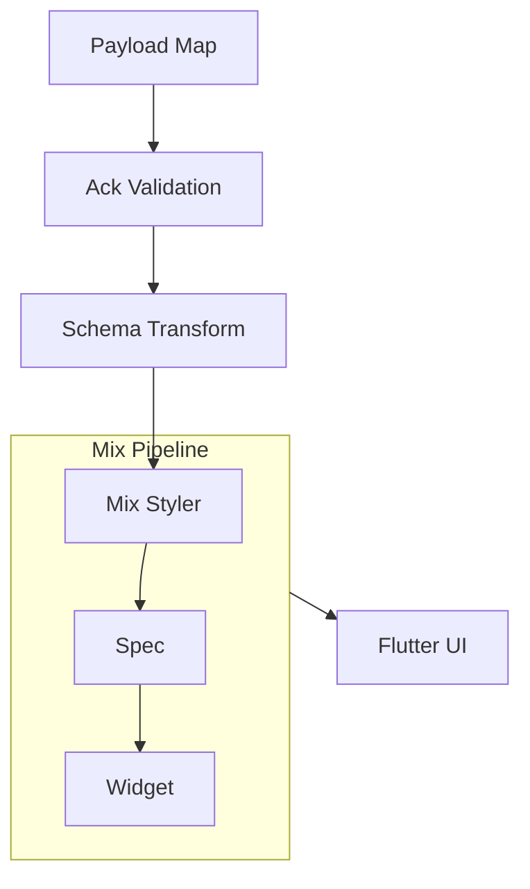

import { Callout } from "nextra/components";

# mix_schema

`mix_schema` decodes external UI payloads into Mix runtime styling objects
through a strict, validated pipeline:

`payload -> Ack validation -> transform -> Mix types`

It is a decode-only package. It does not implement a canonical AST, trust-gate
engine, or action policy layer.

## Architecture

Mix already has a complete resolution pipeline that every developer uses:
**Styler -> Spec -> Widget**. `mix_schema` feeds payloads into that same path.



<Callout type="info">
  `mix_schema` is a strict decoder for Mix stylers and related nested objects.
  It is not a widget runtime or a policy engine.
</Callout>

## What It Supports

- Built-in stylers:
  `box`, `text`, `flex`, `icon`, `image`, `stack`, `flex_box`, `stack_box`
- Shared nested decode for painting, layout, typography, animation, and
  modifiers
- Registry-backed runtime values through `MixSchemaScope`
- Variant decoding, including single context variants and compound
  `context_all_of`

Example compound variant payload:

```json
{
  "type": "box",
  "variants": [
    {
      "type": "context_all_of",
      "conditions": [
        { "type": "context_breakpoint", "minWidth": 768 },
        { "type": "widget_state", "state": "hovered" }
      ],
      "style": {
        "clipBehavior": "hardEdge"
      }
    }
  ]
}
```

Inside compound conditions, supported leaves are:

- `widget_state`
- `enabled`
- `context_brightness`
- `context_breakpoint`
- `context_not_widget_state`
- nested `context_all_of`

`named` and `context_variant_builder` remain valid top-level variant branches,
but they are intentionally excluded from `context_all_of.conditions`.

## What It Does Not Do

- Encode Mix objects back to JSON
- Resolve Tailwind or design-token names on its own
- Replace Mix widgets or widget-layer layout semantics
- Provide a general-purpose boolean policy DSL beyond `context_all_of`

## Related docs

- [mix_tailwinds](/documentation/ecosystem/mix-tailwinds)
- [Design Tokens](/documentation/guides/design-token)
- [Dynamic Styling](/documentation/guides/dynamic-styling)
- [Introduction](/documentation/overview/introduction)
