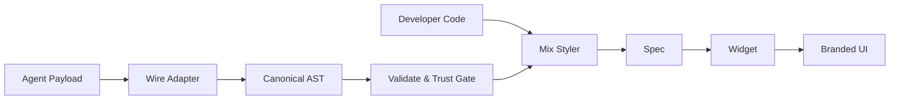
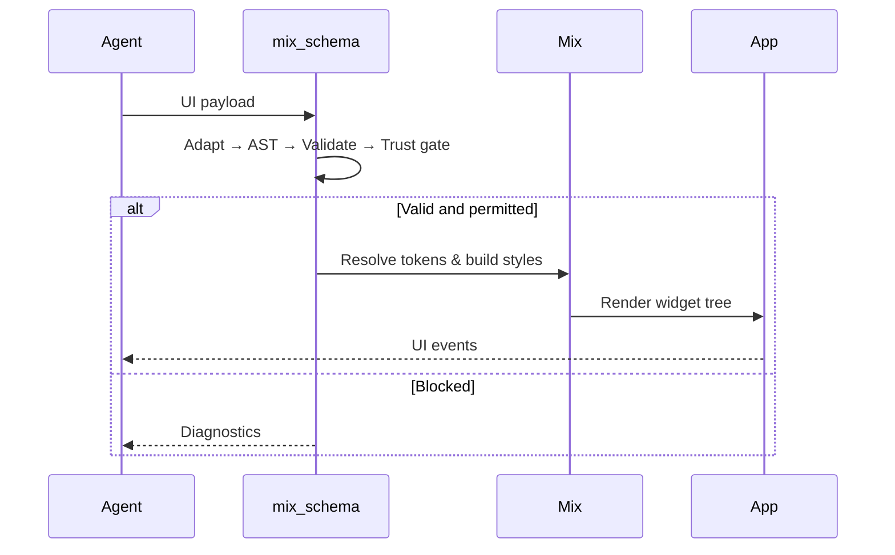

import { Callout } from "nextra/components";

# mix_schema

`mix_schema` bridges AI protocol payloads and Mix-powered Flutter UI through a deterministic, validated rendering pipeline.

## Why this exists

AI-generated UI is powerful but unstable when raw payloads are rendered directly. `mix_schema` adds structure, trust boundaries, and design-system consistency.

## Core benefits

1. Consistent output through a canonical AST.
2. Protocol change isolation through adapter boundaries.
3. Safer execution through trust and action gating.
4. Design fidelity through Mix tokens, variants, and modifiers.
5. Better debugging through deterministic diagnostics.

## Architecture

Both developer-authored and AI-generated UI converge into the same Mix pipeline. The output is indistinguishable.

## Runtime flow

## Trust model

<Callout type="info">
  `mix_schema` treats validation and action policies as first-class runtime contracts, not optional checks.
</Callout>

Risk policy example:

- Low-risk actions: execute directly.
- Medium-risk actions: propose before execute.
- High-risk actions: blocked or explicit approval required.

## Related docs

- [mix_tailwinds](/documentation/ecosystem/mix-tailwinds)
- [Design Tokens](/documentation/guides/design-token)
- [Dynamic Styling](/documentation/guides/dynamic-styling)
- [Introduction](/documentation/overview/introduction)
