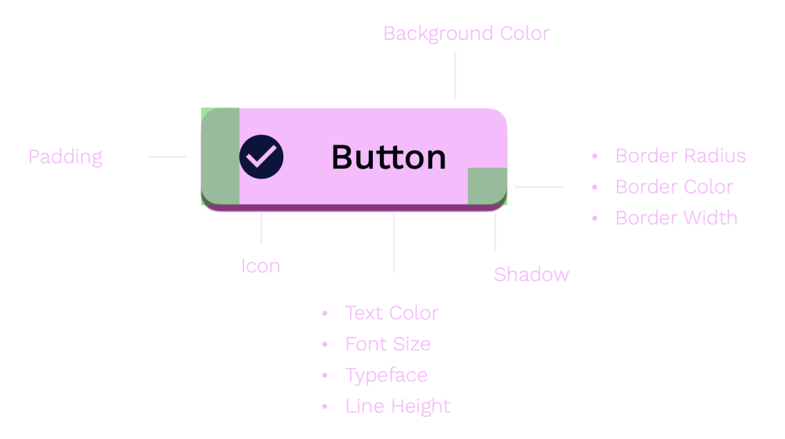
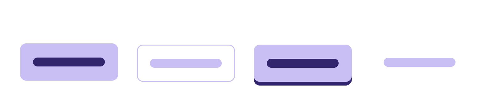
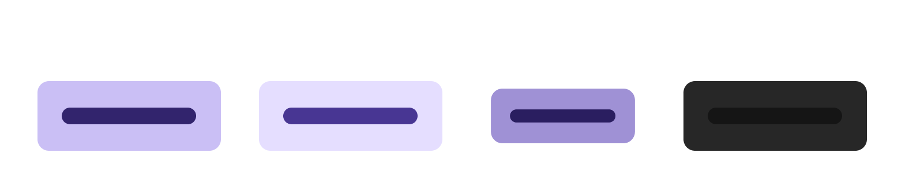
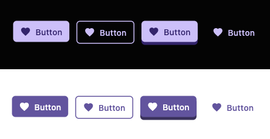

# Building a Design System Widget

This guide walks through creating a design system button with Mix, demonstrating Specs, Stylers, variants, and state handling — using **annotations and code generation** to eliminate boilerplate.



## Component Overview

### Button Variants



- **Filled**: Solid background color
- **Outline**: Transparent background with visible border
- **Elevated**: Shadow effect for raised appearance
- **Link**: Looks like a clickable link, no background

### Button States



- **Normal**: Default state
- **Hover**: Mouse over or keyboard focus
- **Pressed**: Actively being pressed
- **Disabled**: Non-interactive

## Button Structure

- **Container**: Box decoration (border radius, background color, spacing)
- **Icon** (optional): Visual embellishment
- **Label**: Text content

### Create a Button Spec

A `Spec` defines resolved visual properties. With `@MixableSpec()`, the generator creates `copyWith()`, `lerp()`, `debugFillProperties()`, and `props` for you:

```dart
import 'package:flutter/foundation.dart';
import 'package:flutter/material.dart';
import 'package:mix/mix.dart';
import 'package:mix_annotations/mix_annotations.dart';

part 'button_spec.g.dart';

@MixableSpec()
@immutable
final class ButtonSpec extends Spec<ButtonSpec>
    with Diagnosticable, _$ButtonSpecMethods {
  @override
  final StyleSpec<FlexBoxSpec>? container;
  @override
  final StyleSpec<IconSpec>? icon;
  @override
  final StyleSpec<TextSpec>? label;

  const ButtonSpec({this.container, this.icon, this.label});
}
```

That's it — no manual `copyWith`, `lerp`, or `props`. The generated mixin `_$ButtonSpecMethods` provides all of those. Run code generation with:

```bash
dart run build_runner build
```

<details>
<summary>Generated code (`button_spec.g.dart`)</summary>

```dart
// GENERATED CODE - DO NOT MODIFY BY HAND

part of 'button_spec.dart';

mixin _$ButtonSpecMethods on Spec<ButtonSpec>, Diagnosticable {
  StyleSpec<FlexBoxSpec>? get container;
  StyleSpec<IconSpec>? get icon;
  StyleSpec<TextSpec>? get label;

  @override
  ButtonSpec copyWith({
    StyleSpec<FlexBoxSpec>? container,
    StyleSpec<IconSpec>? icon,
    StyleSpec<TextSpec>? label,
  }) {
    return ButtonSpec(
      container: container ?? this.container,
      icon: icon ?? this.icon,
      label: label ?? this.label,
    );
  }

  @override
  ButtonSpec lerp(ButtonSpec? other, double t) {
    return ButtonSpec(
      container: container?.lerp(other?.container, t),
      icon: icon?.lerp(other?.icon, t),
      label: label?.lerp(other?.label, t),
    );
  }

  @override
  void debugFillProperties(DiagnosticPropertiesBuilder properties) {
    super.debugFillProperties(properties);
    properties
      ..add(DiagnosticsProperty('container', container))
      ..add(DiagnosticsProperty('icon', icon))
      ..add(DiagnosticsProperty('label', label));
  }

  @override
  List<Object?> get props => [container, icon, label];
}
```

</details>

### Create a Button Styler

`ButtonStyler` provides a fluent interface for styling. With `@MixableStyler()`, the generator creates setters, `merge()`, `resolve()`, `debugFillProperties()`, and `props`.

Use `@MixableField(setterType: ...)` to tell the generator the public type for each setter. Since the fields are `Prop<StyleSpec<T>>` internally but users pass Styler types, `setterType` bridges that gap:

```dart
part 'button_style.g.dart';

@MixableStyler()
class ButtonStyler extends MixStyler<ButtonStyler, ButtonSpec>
    with _$ButtonStylerMixin {
  @override
  @MixableField(setterType: FlexBoxStyler)
  final Prop<StyleSpec<FlexBoxSpec>>? $container;
  @override
  @MixableField(setterType: IconStyler)
  final Prop<StyleSpec<IconSpec>>? $icon;
  @override
  @MixableField(setterType: TextStyler)
  final Prop<StyleSpec<TextSpec>>? $label;

  ButtonStyler({
    FlexBoxStyler? container,
    IconStyler? icon,
    TextStyler? label,
    super.animation,
    super.modifier,
    super.variants,
  }) : $container = Prop.maybeMix(container),
       $icon = Prop.maybeMix(icon),
       $label = Prop.maybeMix(label);

  const ButtonStyler.create({
    Prop<StyleSpec<FlexBoxSpec>>? container,
    Prop<StyleSpec<IconSpec>>? icon,
    Prop<StyleSpec<TextSpec>>? label,
    super.animation,
    super.modifier,
    super.variants,
  }) : $container = container,
       $icon = icon,
       $label = label;

  // Convenience methods (beyond the generated container/icon/label setters)
  ButtonStyler backgroundColor(Color value) {
    return merge(ButtonStyler(container: FlexBoxStyler().color(value)));
  }

  ButtonStyler textColor(Color value) {
    return merge(ButtonStyler(label: TextStyler().color(value)));
  }

  ButtonStyler iconColor(Color value) {
    return merge(ButtonStyler(icon: IconStyler().color(value)));
  }

  ButtonStyler borderRadius(double value) {
    return merge(ButtonStyler(container: FlexBoxStyler().borderRounded(value)));
  }

  ButtonStyler padding({required double x, required double y}) {
    return merge(
      ButtonStyler(container: FlexBoxStyler().paddingX(x).paddingY(y)),
    );
  }

  ButtonStyler scale(double value) {
    return merge(ButtonStyler(container: FlexBoxStyler().scale(value)));
  }
}
```

The `@MixableField(setterType: FlexBoxStyler)` annotation tells the generator to produce `ButtonStyler container(FlexBoxStyler value)` instead of `ButtonStyler container(StyleSpec<FlexBoxSpec> value)`. This gives users the fluent Styler API they expect.

`MixStyler` already provides `WidgetStateVariantMixin` (for `onPressed`, `onHovered`, `onDisabled`, etc.), `VariantStyleMixin`, and `AnimationStyleMixin` — so you get state handling for free.

The generated `_$ButtonStylerMixin` handles setters, `merge()`, `resolve()`, `debugFillProperties()`, and `props`:

<details>
<summary>Generated code (`button_style.g.dart`)</summary>

```dart
// GENERATED CODE - DO NOT MODIFY BY HAND

part of 'button_style.dart';

mixin _$ButtonStylerMixin on Style<ButtonSpec>, Diagnosticable {
  Prop<StyleSpec<FlexBoxSpec>>? get $container;
  Prop<StyleSpec<IconSpec>>? get $icon;
  Prop<StyleSpec<TextSpec>>? get $label;

  // Generated setters using @MixableField(setterType:)
  ButtonStyler container(FlexBoxStyler value) {
    return merge(ButtonStyler(container: value));
  }

  ButtonStyler icon(IconStyler value) {
    return merge(ButtonStyler(icon: value));
  }

  ButtonStyler label(TextStyler value) {
    return merge(ButtonStyler(label: value));
  }

  @override
  ButtonStyler merge(ButtonStyler? other) {
    return ButtonStyler.create(
      container: MixOps.merge($container, other?.$container),
      icon: MixOps.merge($icon, other?.$icon),
      label: MixOps.merge($label, other?.$label),
      variants: MixOps.mergeVariants($variants, other?.$variants),
      modifier: MixOps.mergeModifier($modifier, other?.$modifier),
      animation: MixOps.mergeAnimation($animation, other?.$animation),
    );
  }

  @override
  StyleSpec<ButtonSpec> resolve(BuildContext context) {
    final spec = ButtonSpec(
      container: MixOps.resolve(context, $container),
      icon: MixOps.resolve(context, $icon),
      label: MixOps.resolve(context, $label),
    );

    return StyleSpec(
      spec: spec,
      animation: $animation,
      widgetModifiers: $modifier?.resolve(context),
    );
  }

  @override
  void debugFillProperties(DiagnosticPropertiesBuilder properties) {
    super.debugFillProperties(properties);
    properties
      ..add(DiagnosticsProperty('container', $container))
      ..add(DiagnosticsProperty('icon', $icon))
      ..add(DiagnosticsProperty('label', $label));
  }

  @override
  List<Object?> get props =>
      [$container, $icon, $label, $animation, $modifier, $variants];
}
```

</details>

### Define Variants

Use an enum to define button variants with their styles:

```dart
enum ButtonVariant {
  filled,
  outlined,
  elevated,
  link;

  ButtonStyler get style {
    switch (this) {
      case ButtonVariant.filled:
        return ButtonStyler()
            .backgroundColor(Colors.blueAccent)
            .textColor(Colors.white)
            .iconColor(Colors.white);
      
      case ButtonVariant.outlined:
        return ButtonStyler()
            .container(
              FlexBoxStyler()
                  .color(Colors.transparent)
                  .borderAll(width: 1.5, color: Colors.blueAccent),
            )
            .textColor(Colors.blueAccent)
            .iconColor(Colors.blueAccent);
      
      case ButtonVariant.elevated:
        return ButtonStyler()
            .backgroundColor(Colors.blueAccent)
            .textColor(Colors.white)
            .iconColor(Colors.white)
            .container(
              FlexBoxStyler().shadow(
                BoxShadowMix()
                    .color(Colors.blueAccent.shade700)
                    .offset(x: 0, y: 5),
              ),
            );
      
      case ButtonVariant.link:
        return ButtonStyler()
            .container(
              FlexBoxStyler()
                  .borderAll(style: BorderStyle.none)
                  .color(Colors.transparent),
            )
            .textColor(Colors.blueAccent)
            .iconColor(Colors.blueAccent);
    }
  }
}
```

## Create the Button Widget

`CustomButton` uses `Pressable` for interaction states and `StyleBuilder` to resolve styles:

```dart
class CustomButton extends StatelessWidget {
  const CustomButton({
    super.key,
    required this.label,
    this.disabled = false,
    this.icon,
    required this.onPressed,
    this.variant = ButtonVariant.filled,
    this.style,
  });

  final String label;
  final bool disabled;
  final IconData? icon;
  final ButtonVariant variant;
  final VoidCallback? onPressed;
  final ButtonStyler? style;

  @override
  Widget build(BuildContext context) {
    return Pressable(
      onPress: disabled ? null : onPressed,
      enabled: !disabled,
      child: StyleBuilder(
        style: buttonStyle(style, variant),
        builder: (context, spec) {
          return FlexBox(
            styleSpec: spec.container,
            children: [
              if (icon != null) StyledIcon(icon: icon, styleSpec: spec.icon),
              if (label.isNotEmpty) StyledText(label, styleSpec: spec.label),
            ],
          );
        },
      ),
    );
  }
}
```

## Styling Your Button

The `buttonStyle` function defines base styles, merges variant styles, and adds state handling:

```dart
ButtonStyler buttonStyle(ButtonStyler? style, ButtonVariant? variant) {
  // Base styles shared across all variants
  final container = FlexBoxStyler()
      .borderRounded(6)
      .paddingX(8)
      .paddingY(12)
      .spacing(8)
      .mainAxisAlignment(MainAxisAlignment.center)
      .crossAxisAlignment(CrossAxisAlignment.center)
      .mainAxisSize(MainAxisSize.min);

  final label = TextStyler().style(
    TextStyleMix().fontSize(16).fontWeight(FontWeight.w500),
  );

  final icon = IconStyler().size(18);

  return ButtonStyler()
      .container(container)
      .label(label)
      .icon(icon)
      .merge(variant?.style)
      .onPressed(
        ButtonStyler()
            .container(FlexBoxStyler().scale(0.9)),
      )
      .onDisabled(
        ButtonStyler()
            .container(FlexBoxStyler().color(Colors.blueGrey.shade100))
            .label(
              TextStyler().style(
                TextStyleMix().color(Colors.blueGrey.shade700),
              ),
            )
            .icon(IconStyler().color(Colors.blueGrey.shade700)),
      )
      .merge(style);
}
```

### Button Variant Widgets

Create convenience widgets for each variant:

```dart
final class FilledButton extends CustomButton {
  const FilledButton({
    super.key,
    required super.label,
    super.disabled = false,
    super.icon,
    required super.onPressed,
    super.style,
  }) : super(variant: ButtonVariant.filled);
}

final class OutlinedButton extends CustomButton {
  const OutlinedButton({
    super.key,
    required super.label,
    super.disabled = false,
    super.icon,
    required super.onPressed,
    super.style,
  }) : super(variant: ButtonVariant.outlined);
}

final class ElevatedButton extends CustomButton {
  const ElevatedButton({
    super.key,
    required super.label,
    super.disabled = false,
    super.icon,
    required super.onPressed,
    super.style,
  }) : super(variant: ButtonVariant.elevated);
}

final class LinkButton extends CustomButton {
  const LinkButton({
    super.key,
    required super.label,
    super.disabled = false,
    super.icon,
    required super.onPressed,
    super.style,
  }) : super(variant: ButtonVariant.link);
}
```

## Results



```dart
// Main App
void main() {
  runApp(const MyApp());
}

class MyApp extends StatelessWidget {
  const MyApp({super.key});

  @override
  Widget build(BuildContext context) {
    return const MaterialApp(
      home: ButtonExampleScreen(),
    );
  }
}

class ButtonExampleScreen extends StatelessWidget {
  const ButtonExampleScreen({super.key});

  @override
  Widget build(BuildContext context) {
    final icon = Icons.favorite;

    return Scaffold(
      appBar: AppBar(
        title: const Text('Button Examples'),
      ),
      body: Padding(
        padding: const EdgeInsets.all(16.0),
        child: Column(
          mainAxisAlignment: MainAxisAlignment.center,
          crossAxisAlignment: CrossAxisAlignment.stretch,
          children: [
            FilledButton(
              label: 'Filled Button',
              icon: icon,
              onPressed: () {},
            ),
            const SizedBox(height: 10),
            OutlinedButton(
              label: 'Outlined Button',
              icon: icon,
              onPressed: () {},
            ),
            const SizedBox(height: 10),
            ElevatedButton(
              label: 'Elevated Button',
              icon: icon,
              onPressed: () {},
            ),
            const SizedBox(height: 10),
            LinkButton(
              label: 'Link Button',
              icon: icon,
              onPressed: () {},
            ),
            const SizedBox(height: 20),
            const Text(
              'Disabled State:',
              style: TextStyle(fontSize: 18, fontWeight: FontWeight.bold),
            ),
            const SizedBox(height: 10),
            FilledButton(
              label: 'Disabled Button',
              icon: icon,
              disabled: true,
              onPressed: () {},
            ),
          ],
        ),
      ),
    );
  }
}
```

## Summary

This tutorial covered:

- **`@MixableSpec`**: Generates `copyWith()`, `lerp()`, `debugFillProperties()`, and `props` — no manual boilerplate
- **`@MixableStyler`**: Generates setters, `merge()`, `resolve()`, `debugFillProperties()`, and `props` — you only write convenience methods
- **`@MixableField(setterType:)`**: Controls the public type of generated setters (e.g., accept `FlexBoxStyler` instead of `StyleSpec<FlexBoxSpec>`)
- **`MixStyler`**: Base class that provides `WidgetStateVariantMixin`, `VariantStyleMixin`, and `AnimationStyleMixin` for free
- **ButtonVariant**: Enum associating variants with styles
- **CustomButton**: Widget combining `Pressable` and `StyleBuilder`

### What you write vs. what's generated

| You write | Generator provides |
|---|---|
| Spec fields and constructor | `copyWith()`, `lerp()`, `debugFillProperties()`, `props` |
| Styler fields, constructors, convenience methods | Setters (via `@MixableField`), `merge()`, `resolve()`, `debugFillProperties()`, `props` |

This pattern extends to other components: cards, inputs, dialogs, etc. Add `mix_annotations` to your `dependencies` and `mix_generator` to `dev_dependencies`, then run `dart run build_runner build` to generate code.
