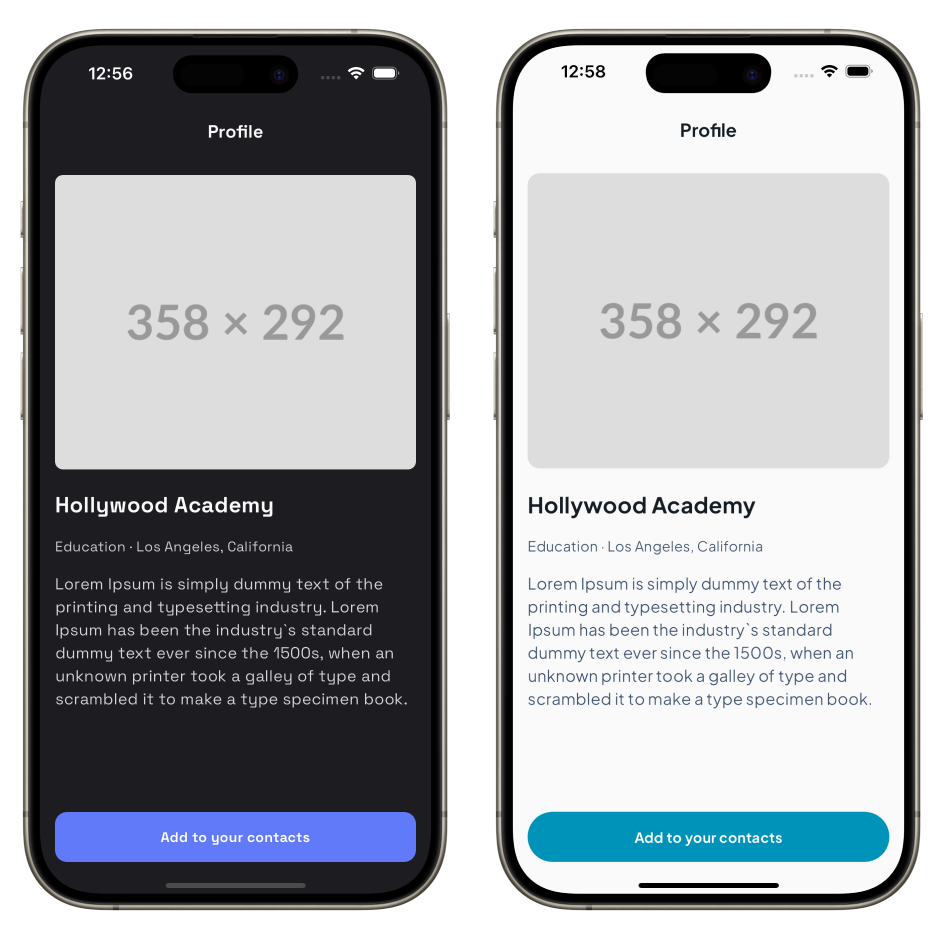
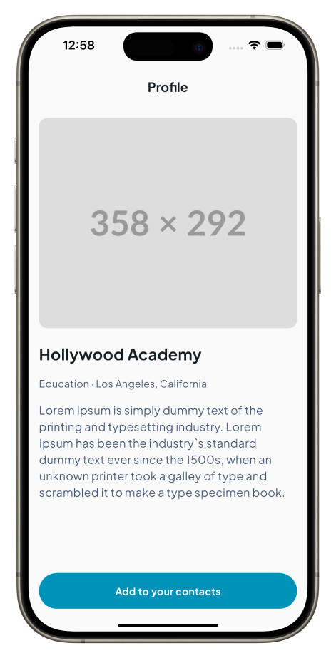

# Theming

## Introduction

Mix offers a robust theming system that enables you to style your application consistently and efficiently, providing both scalability and flexibility. The theming system is built on the concept of design tokens, which are key-value pairs defining visual properties such as colors, text styles, spacing, and border radii. These tokens can be uniformly applied across all your widgets, ensuring a consistent aesthetic throughout your application. You can easily alter the appearance of your application by updating the design tokens, without modifying individual widget implementations.

## Getting Started

In this guide, we will create a single-screen, multi-theme application to demonstrate the power of Mix's theming system. The final result will look like this:



As depicted in the image above, we have two different themes for the same screen, each using distinct colors, text styles, fonts, and border radii. The left one employs a light theme with blue as the primary color, hence it will be referred to as `LightBlueTheme`. The right one utilizes a dark theme with purple as the primary color, and will therefore be named `DarkPurpleTheme`.

## Setting Up MixScope

Before we start styling our application with these themes, the initial step is to configure `MixScope`. `MixScope` acts as an ancestor widget that passes down the defined tokens to all its child widgets, ensuring they can access and utilize the same styling information. Properly setting up MixScope is crucial to harnessing the full potential of the Mix package for your application's theming needs.

Here's how you can initialize and implement `MixScope`:

### Wrapping the Root Widget

To apply your theme globally, you'll want to wrap your application's widgets with the `MixScope` widget, providing token values through named parameters.

```dart
class MyApp extends StatelessWidget {
  const MyApp({super.key});

  @override
  Widget build(BuildContext context) {
    return MixScope(
      colors: LightBlueTheme.colors,
      textStyles: LightBlueTheme.textStyles,
      radii: LightBlueTheme.radii,
      spaces: LightBlueTheme.spaces,
      child: const MaterialApp(
        home: ProfilePage(),
      ),
    );
  }
}
```

### Creating Design Tokens

The next crucial step is defining your design tokens. In Mix, there are several types of design tokens: `ColorToken`, `TextStyleToken`, `SpaceToken`, `RadiusToken`, and `BreakpointToken`. Each token type represents a different design property. 

The recommended way to organize your tokens is using Dart enums. This provides type safety, autocomplete support, and a clean API. Here's how to define your token enums:

```dart
enum CustomColorTokens {
  primary('primary'),
  onPrimary('on-primary'),
  surface('surface'),
  onSurface('on-surface'),
  onSurfaceVariant('on-surface-variant');

  final String name;
  const CustomColorTokens(this.name);

  ColorToken get token => ColorToken(name);
}

enum CustomTextStyleTokens {
  headline1('headline1'),
  headline2('headline2'),
  button('button'),
  body('body'),
  callout('callout');

  final String name;
  const CustomTextStyleTokens(this.name);

  TextStyleToken get token => TextStyleToken(name);
}

enum MyThemeRadiusToken {
  large('large'),
  medium('medium');

  final String name;
  const MyThemeRadiusToken(this.name);

  RadiusToken get token => RadiusToken(name);
}

enum MyThemeSpaceToken {
  medium('medium'),
  large('large');

  final String name;
  const MyThemeSpaceToken(this.name);

  SpaceToken get token => SpaceToken(name);
}
```

With this approach, you access tokens like this:

```dart
final primaryColorToken = CustomColorTokens.primary.token;
final headline1TextStyleToken = CustomTextStyleTokens.headline1.token;
```

### Creating Theme Data

Now that we have our tokens defined, we need to create theme classes that map tokens to their actual values. We'll organize these as static maps within theme classes. This makes it easy to switch between themes.

Here's the `LightBlueTheme`:

```dart
class LightBlueTheme {
  static Map<ColorToken, Color> get colors => {
    CustomColorTokens.primary.token: const Color(0xFF0093B9),
    CustomColorTokens.onPrimary.token: const Color(0xFFFAFAFA),
    CustomColorTokens.surface.token: const Color(0xFFFAFAFA),
    CustomColorTokens.onSurface.token: const Color(0xFF141C24),
    CustomColorTokens.onSurfaceVariant.token: const Color(0xFF405473),
  };

  static Map<TextStyleToken, TextStyle> get textStyles => {
    CustomTextStyleTokens.headline1.token: const TextStyle(
      fontSize: 22,
      fontWeight: FontWeight.bold,
      fontFamily: 'Roboto',
    ),
    CustomTextStyleTokens.headline2.token: const TextStyle(
      fontSize: 18,
      fontWeight: FontWeight.bold,
      fontFamily: 'Roboto',
    ),
    CustomTextStyleTokens.button.token: const TextStyle(
      fontSize: 14,
      fontWeight: FontWeight.bold,
      fontFamily: 'Roboto',
    ),
    CustomTextStyleTokens.body.token: const TextStyle(
      fontSize: 16,
      fontWeight: FontWeight.normal,
      fontFamily: 'Roboto',
    ),
    CustomTextStyleTokens.callout.token: const TextStyle(
      fontSize: 14,
      fontWeight: FontWeight.normal,
      fontFamily: 'Roboto',
    ),
  };

  static Map<RadiusToken, Radius> get radii => {
    MyThemeRadiusToken.large.token: const Radius.circular(100),
    MyThemeRadiusToken.medium.token: const Radius.circular(12),
  };

  static Map<SpaceToken, double> get spaces => {
    MyThemeSpaceToken.medium.token: 16,
    MyThemeSpaceToken.large.token: 24,
  };
}
```

And the `DarkPurpleTheme`:

```dart
class DarkPurpleTheme {
  static Map<ColorToken, Color> get colors => {
    CustomColorTokens.primary.token: const Color(0xFF617AFA),
    CustomColorTokens.onPrimary.token: const Color(0xFFFAFAFA),
    CustomColorTokens.surface.token: const Color(0xFF1C1C21),
    CustomColorTokens.onSurface.token: const Color(0xFFFAFAFA),
    CustomColorTokens.onSurfaceVariant.token: const Color(0xFFD6D6DE),
  };

  static Map<TextStyleToken, TextStyle> get textStyles => {
    CustomTextStyleTokens.headline1.token: const TextStyle(
      fontSize: 22,
      fontWeight: FontWeight.bold,
      fontFamily: 'Courier',
    ),
    CustomTextStyleTokens.headline2.token: const TextStyle(
      fontSize: 18,
      fontWeight: FontWeight.bold,
      fontFamily: 'Courier',
    ),
    CustomTextStyleTokens.button.token: const TextStyle(
      fontSize: 14,
      fontWeight: FontWeight.bold,
      fontFamily: 'Courier',
    ),
    CustomTextStyleTokens.body.token: const TextStyle(
      fontSize: 16,
      fontWeight: FontWeight.normal,
      fontFamily: 'Courier',
    ),
    CustomTextStyleTokens.callout.token: const TextStyle(
      fontSize: 14,
      fontWeight: FontWeight.normal,
      fontFamily: 'Courier',
    ),
  };

  static Map<RadiusToken, Radius> get radii => {
    MyThemeRadiusToken.large.token: const Radius.circular(12),
    MyThemeRadiusToken.medium.token: const Radius.circular(8),
  };

  static Map<SpaceToken, double> get spaces => {
    MyThemeSpaceToken.medium.token: 16,
    MyThemeSpaceToken.large.token: 24,
  };
}
```

## Creating the UI

Now that we have defined our themes, we can start creating the UI for our application. We will create a simple profile page with an image and some text, and then apply the themes to the UI.

### Creating the Components

The interface chosen for this guide is quite simple. The only custom component is a button, so let's create that first.

```dart
class ProfileButton extends StatelessWidget {
  const ProfileButton({super.key, required this.label});

  final String label;

  @override
  Widget build(BuildContext context) {
    // Create a box styler with tokens
    final box = BoxStyler()
        .height(50)
        .width(double.infinity)
        .color(CustomColorTokens.primary.token())
        .alignment(Alignment.center)
        .borderRadiusAll(MyThemeRadiusToken.large.token());

    // Create a text styler with tokens
    final text = TextStyler()
        .style(CustomTextStyleTokens.button.token.mix())
        .color(CustomColorTokens.onPrimary.token());

    // Use stylers as callable functions
    return box(child: text(label));
  }
}
```

This code demonstrates several key concepts:

1. **Token calling**: Call tokens as functions with `token()` to get token references for use in stylers
2. **TextStyle tokens**: Use `.token.mix()` for text style tokens to get the Mix-compatible reference
3. **Callable stylers**: Mix stylers can be called like functions, passing the child widget directly
4. **Fluent API**: Chain styling methods for clean, readable code

### Creating the ProfilePage

Now that we have built the `ProfileButton`, we can create the `ProfilePage` widget. This page uses a combination of Mix widgets and Flutter's native Scaffold.

```dart
class ProfilePage extends StatelessWidget {
  const ProfilePage({super.key});

  @override
  Widget build(BuildContext context) {
    // AppBar title styling
    final appBarTitle = TextStyler()
        .style(CustomTextStyleTokens.headline2.token.mix())
        .color(CustomColorTokens.onSurface.token());

    // Layout styling with FlexBoxStyler
    final flexBox = FlexBoxStyler()
        .crossAxisAlignment(.start)
        .marginAll(MyThemeSpaceToken.medium.token())
        .spacing(MyThemeSpaceToken.medium.token());

    return Scaffold(
      backgroundColor: CustomColorTokens.surface.token.resolve(context),
      appBar: AppBar(
        backgroundColor: CustomColorTokens.surface.token.resolve(context),
        title: appBarTitle('Profile'),
        centerTitle: false,
      ),
      body: SafeArea(
        child: ColumnBox(
          style: flexBox,
          children: [
            // Image placeholder
            ImagePlaceholder(),
            // Title
            StyledText(
              'Hollywood Academy',
              style: TextStyler()
                  .style(CustomTextStyleTokens.headline1.token.mix())
                  .color(CustomColorTokens.onSurface.token()),
            ),
            // Subtitle
            StyledText(
              'Education · Los Angeles, California',
              style: TextStyler()
                  .style(CustomTextStyleTokens.callout.token.mix())
                  .color(CustomColorTokens.onSurfaceVariant.token()),
            ),
            // Description
            StyledText(
              'Lorem Ipsum is simply dummy text of the printing and typesetting industry.',
              style: TextStyler()
                  .style(CustomTextStyleTokens.body.token.mix())
                  .color(CustomColorTokens.onSurfaceVariant.token()),
            ),
            const Spacer(),
            // Button
            const ProfileButton(label: 'Add to your contacts'),
          ],
        ),
      ),
    );
  }
}

class ImagePlaceholder extends StatelessWidget {
  const ImagePlaceholder({super.key});

  @override
  Widget build(BuildContext context) {
    final imageContainer = BoxStyler()
        .height(200)
        .width(double.infinity)
        .color(CustomColorTokens.primary.token())
        .borderRadiusAll(MyThemeRadiusToken.medium.token());

    final icon = IconStyler()
        .size(80)
        .color(CustomColorTokens.onPrimary.token());

    return imageContainer(child: icon(icon: Icons.image));
  }
}
```

Key points about this implementation:

1. **ColumnBox**: Use Mix's `ColumnBox` with `FlexBoxStyler` for layout control with token-based spacing
2. **Token resolution**: For native Flutter widgets like Scaffold and AppBar, use `.resolve(context)` to get actual values
3. **Callable stylers**: Text stylers can be called as functions to create styled text widgets
4. **Component composition**: Break down complex UIs into smaller, reusable components like `ImagePlaceholder`

Now that everything is set up, you can wrap your app with `MixScope` to provide the theme values.



## Switching Between Themes

One of the powerful features of Mix's theming system is the ability to switch themes dynamically. Here's how you can implement theme switching:

```dart
class ThemingTutorialApp extends StatefulWidget {
  const ThemingTutorialApp({super.key});

  @override
  State<ThemingTutorialApp> createState() => _ThemingTutorialAppState();
}

class _ThemingTutorialAppState extends State<ThemingTutorialApp> {
  bool _isDarkPurpleTheme = false;

  @override
  Widget build(BuildContext context) {
    // Select theme based on state
    final colors = _isDarkPurpleTheme 
        ? DarkPurpleTheme.colors 
        : LightBlueTheme.colors;
    final textStyles = _isDarkPurpleTheme
        ? DarkPurpleTheme.textStyles
        : LightBlueTheme.textStyles;
    final radii = _isDarkPurpleTheme 
        ? DarkPurpleTheme.radii 
        : LightBlueTheme.radii;
    final spaces = _isDarkPurpleTheme 
        ? DarkPurpleTheme.spaces 
        : LightBlueTheme.spaces;

    return MixScope(
      colors: colors,
      textStyles: textStyles,
      radii: radii,
      spaces: spaces,
      child: const ProfilePage(),
    );
  }
}
```

To toggle the theme, simply call `setState` to update `_isDarkPurpleTheme`. All widgets using tokens will automatically update to reflect the new theme.

## Key Takeaways

Mix's theming system provides:

1. **Type-safe tokens**: Enum-based tokens with compile-time safety and autocomplete support
2. **Easy theme switching**: Change themes by updating token value maps
3. **Consistent styling**: Tokens ensure design consistency across your entire app
4. **Fluent API**: Chainable stylers with callable functions for clean code
5. **Flexible integration**: Works seamlessly with both Mix widgets and native Flutter widgets

## Best Practices

- **Organize tokens by category**: Use separate enums for colors, text styles, radii, and spacing
- **Use static theme classes**: Keep theme data organized in classes with static getters
- **Leverage callable stylers**: Use stylers as functions for concise component code
- **Compose components**: Break down UIs into smaller, reusable styled components
- **Mix with Flutter**: Use Mix for your design system components, native Flutter widgets where appropriate
